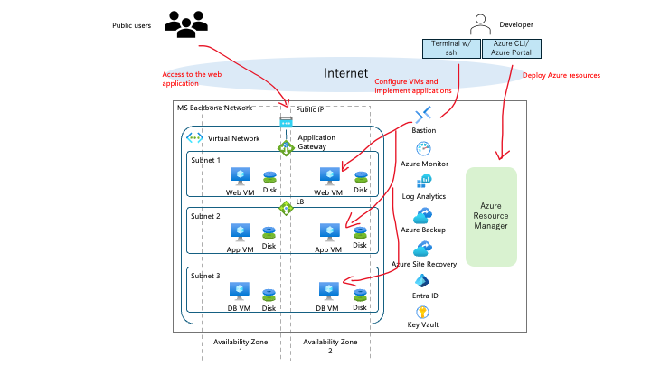

# Azure IaaS ワークショップ - マルチユーザー ブログ アプリケーション

[](https://opensource.org/licenses/MIT)

Engilish version: [README.md](./README.md)

回復性の高いマルチティア Web アプリケーションを構築・デプロイしながら、Azure IaaS パターンを学ぶハンズオン ワークショップです。

---

## 目次

- [1. はじめに](#1-はじめに)
  - [1.1 このワークショップについて](#11-このワークショップについて)
  - [1.2 学習内容](#12-学習内容)
  - [1.3 アプリケーション概要](#13-アプリケーション概要)
  - [1.4 アーキテクチャ概要](#14-アーキテクチャ概要)
- [2. デプロイ方法](#2-デプロイ方法)
  - [2.1 前提条件](#21-前提条件)
  - [2.2 ローカル開発（オプション）](#22-ローカル開発環境オプション)
  - [2.3 Azure デプロイ](#23-azure-デプロイ)
- [3. 回復性テスト](#3-回復性テスト)
- [4. 運用ガイド](#4-運用ガイド)

---

## 1. はじめに

### 1.1 このワークショップについて

このワークショップは、本番運用を意識した Web アプリケーションを実際に構築しながら、**Azure Infrastructure as a Service (IaaS)** パターンを学びたいエンジニア向けに設計されています。

**対象者:**
- 3〜5年の経験を持つエンジニア（特にAWSに精通している方）
- Azure認定資格（AZ-104、AZ-305）の準備をしている開発者
- AWSからAzureへ移行しているチーム

**ワークショップ期間:** 約4時間

### 1.2 学習内容

このワークショップを完了すると、以下の実践的な経験が得られます：

| トピック | Azureサービス |
|-------|----------------|
| **高可用性** | 可用性ゾーン、ロードバランサー、Application Gateway |
| **ネットワーク** | 仮想ネットワーク、サブネット、NSG、NAT Gateway、Bastion |
| **コンピューティング** | 仮想マシン、VMスケールの概念 |
| **セキュリティ** | Microsoft Entra ID、マネージドID、Key Vault |
| **Infrastructure as Code** | Bicepテンプレート、ARMデプロイ |
| **監視** | Azure Monitor、Log Analytics（予定） |
| **災害復旧** | Azure Site Recoveryの概念（予定） |

### 1.3 アプリケーション概要

サンプル アプリケーションは、以下の機能を持つ **マルチユーザー ブログ プラットフォーム** です。

**すべてのユーザー向け（パブリック）:**
- 📖 公開されたブログ投稿の閲覧
- 🔍 著者情報付きの投稿詳細の表示

**認証済みユーザー向け:**
- ✍️ 自分のブログ投稿の作成、編集、削除
- 📝 公開前に下書きとして保存
- 👤 プロフィールの管理と自分の投稿の表示

**技術スタック:**

| レイヤー | 技術 |
|-------|------------|
| フロントエンド | React 18、TypeScript、TailwindCSS、Vite |
| バックエンド | Node.js 20、Express.js、TypeScript |
| データベース | MongoDB 7.0（レプリカセット構成） |
| 認証 | Microsoft Entra ID（Azure AD）+ MSAL.js |

### 1.4 アーキテクチャ概要

#### Azure（本番）アーキテクチャ



**使用する主要な Azure サービス:**

| サービス | 目的 |
|---------|---------|
| **Virtual Machines** | 全3ティアのコンピューティング |
| **Application Gateway** | SSL終端付きレイヤー7ロードバランサー |
| **Standard Load Balancer** | Appティア用内部ロードバランシング |
| **Virtual Network** | 4サブネットのネットワーク分離 |
| **NAT Gateway** | プライベートVM用アウトバウンドインターネット |
| **Azure Bastion** | パブリックIPなしのセキュアSSHアクセス |
| **Network Security Groups** | 各ティアのファイアウォールルール |
| **可用性ゾーン** | データセンター間の高可用性 |

---

## 2. デプロイ方法

このセクションでは、アプリケーションを Azure にデプロイする方法を説明します。

> **📝 ローカル開発環境をお探しですか？**
> ローカルマシンでアプリケーションを実行するには、[ローカル開発ガイド](materials/docs/local-development-guide.ja.md)を参照してください。

| 環境 | ユースケース | 所要時間 |
|-------------|----------|---------------|
| **Azure** | 本番デプロイ、ワークショップ演習 | 45〜90分 |

### 2.1 前提条件

開始前に、以下のツールのインストールとアカウントの準備ができていることを確認してください。

#### 2.1.1 必要なツール

コンピュータに以下のツールをインストールしてください：

**全プラットフォーム共通:**

| ツール | バージョン | 目的 | インストール |
|------|---------|---------|--------------|
| **Git** | 2.x以上 | バージョン管理 | [ダウンロード](https://git-scm.com/) |
| **VS Code** | 最新版 | コードエディタ（推奨） | [ダウンロード](https://code.visualstudio.com/) |

**macOS/Linux:**

| ツール | バージョン | 目的 | インストール |
|------|---------|---------|--------------|
| **Azure CLI** | 2.60以上 | Azure管理 | [インストールガイド](https://docs.microsoft.com/cli/azure/install-azure-cli) |
| **OpenSSL** | 最新版 | SSL証明書生成 | プリインストール済み |

**Windows:**

| ツール | バージョン | 目的 | インストール |
|------|---------|---------|--------------|
| **Azure PowerShell** | 12.0以上 | Azure管理 | [インストールガイド](https://docs.microsoft.com/powershell/azure/install-azure-powershell) |
| **Bicep CLI** | 最新版 | Infrastructure as Code | [インストールガイド](https://learn.microsoft.com/azure/azure-resource-manager/bicep/install#windows) |
| **OpenSSL** | 最新版 | SSL証明書生成 | [ダウンロード](https://slproweb.com/products/Win32OpenSSL.html) |

> **⚠️ 重要: WindowsではBicep CLIが必要です**  
> Azure CLI（Bicepを自動インストール）とは異なり、Azure PowerShellではBicep CLIを手動でインストールする必要があります。
> 
> **推奨インストール方法（winget）:**
> ```powershell
> winget install -e --id Microsoft.Bicep
> ```
> 
> **代替方法:**
> - **Chocolatey:** `choco install bicep`
> - **Windowsインストーラー:** [bicep-setup-win-x64.exeをダウンロード](https://github.com/Azure/bicep/releases/latest/download/bicep-setup-win-x64.exe)
> 
> インストール後、ターミナルを閉じて再度開き、確認してください:
> ```powershell
> bicep --version
> # 期待値: Bicep CLI version 0.x.x
> ```

**インストールの確認:**

**macOS/Linux:**
```bash
# Gitの確認
git --version
# 期待値: git version 2.x.x

# Azure CLIの確認
az --version
# 期待値: azure-cli 2.60.x以降

# OpenSSLの確認
openssl version
# 期待値: OpenSSL 3.x.x または LibreSSL 3.x.x
```

**Windows PowerShell:**
```powershell
# Gitの確認
git --version
# 期待値: git version 2.x.x

# Azure PowerShellの確認
Get-Module -Name Az -ListAvailable | Select-Object Name, Version
# 期待値: Az 12.x.x以降

# Bicep CLIの確認
bicep --version
# 期待値: Bicep CLI version 0.x.x

# OpenSSLの確認
openssl version
# 期待値: OpenSSL 3.x.x
```

> **📝 Node.jsとDockerが必要ですか？** これらは[ローカル開発](materials/docs/local-development-guide.ja.md)にのみ必要で、Azureデプロイには必要ありません。

#### 2.1.2 必要なアカウント

以下へのアクセスが必要です：

| アカウント | 目的 | 取得方法 |
|---------|---------|------------|
| **Microsoft Azure** | クラウドプラットフォーム | [無料アカウント](https://azure.microsoft.com/free/)。ワークショップの参加者はアクティブなサブスクリプションと所有者ロールが必要です。 |
| **Microsoft Entra ID** | 認証 | Azureサブスクリプションに含まれる |
| **GitHub**（オプション） | リポジトリのクローン | [サインアップ](https://github.com/join) |

> **💡 Azure 初心者向けヒント:** Azure は新規アカウントに $200 の無料クレジットを提供しています。これはこのワークショップを完了するのに十分な金額です。

#### 2.1.3 Entra IDに必要な権限

> ⚠️ **重要: 開始前に権限を確認してください**
>
> Microsoft Entra IDでアプリ登録を作成するには、以下のいずれかが必要です：
>
> | ロール/設定 | 所有者 |
> |--------------|------------|
> | **アプリケーション開発者**ロール | IT管理者が割り当て |
> | **クラウドアプリケーション管理者**ロール | IT管理者が割り当て |
> | **グローバル管理者**ロール | テナント管理者 |
> | **「ユーザーはアプリケーションを登録できる」** = はい | デフォルトのテナント設定（無効化されている場合あり） |
>
> **権限があるか確認する方法:**
> 1. [Azure Portal](https://portal.azure.com) → Microsoft Entra ID → アプリの登録 に移動
> 2. 「+ 新規登録」をクリック
> 3. 登録フォームが表示されれば、権限があります ✅
> 4. エラーが表示されるかボタンが無効な場合は、IT管理者に連絡してください ❌
>
> **ワークショップ主催者向け:**
> 参加者がアプリ登録を作成できない場合、2つのオプションがあります：
> 1. **IT管理者に依頼**して、参加者に「アプリケーション開発者」ロールを割り当ててもらう
> 2. **アプリ登録を事前作成**し、クライアントIDを参加者と共有する
>
> **個人/無料Azureアカウントの場合:**
> 自分でAzureアカウントを作成した場合、自動的にグローバル管理者となり、追加設定なしでアプリ登録を作成できます。

#### 2.1.4 リポジトリのクローン

ワークショップのリポジトリをローカルマシンにクローンします：

```bash
# 公式リポジトリをクローン
git clone https://github.com/hironariy/Azure-IaaS-Workshop.git

# プロジェクトフォルダに移動
cd Azure-IaaS-Workshop
```

> **💡 ワークショップ参加者向け:** このリポジトリを自分のGitHubアカウントにフォークした場合は、フォークしたリポジトリをクローンしてください：
> ```bash
> git clone https://github.com/YOUR_USERNAME/Azure-IaaS-Workshop.git
> cd Azure-IaaS-Workshop
> ```

#### 2.1.5 Microsoft Entra IDアプリ登録

Microsoft Entra ID で **2 つのアプリ登録** を作成する必要があります。これは Azure デプロイに必要です（ローカル開発にも使用します）。

> **なぜ2つのアプリ登録が必要？**
> - **フロントエンドアプリ**: MSAL.js経由のユーザーログイン処理（ブラウザベース）
> - **バックエンドAPIアプリ**: JWTトークンの検証とAPIエンドポイントの保護

**ステップバイステップガイド:**

<details>
<summary>📝 クリックして展開: フロントエンドアプリ登録の作成</summary>

1. **Azure Portalを開く**
   - [portal.azure.com](https://portal.azure.com) にアクセス
   - Microsoftアカウントでサインイン

2. **Entra IDに移動**
   - 上部の検索バーで「Entra ID」と入力
   - 「Microsoft Entra ID」をクリック

3. **アプリ登録を作成**
   - 左メニューで「管理」>「アプリの登録」をクリック
   - 「+ 新規登録」ボタンをクリック

4. **アプリを構成**
   - **名前**: `BlogApp Frontend (Dev)`（または任意の名前）
   - **サポートされているアカウントの種類**: 「この組織ディレクトリのみに含まれるアカウント」を選択
   - **リダイレクトURI**: 
     - ドロップダウンから**「シングルページアプリケーション (SPA)」**を選択
     - 入力: `http://localhost:5173`

   > ⚠️ **重要**: 必ず**「シングルページアプリケーション (SPA)」**を選択してください - 「Web」ではありません。
   > 「Web」を選択すると、認証がエラー`AADSTS9002326`で失敗します。

5. **「登録」をクリック**

6. **重要な値をコピー**（後で必要になります）
   - **アプリケーション (クライアント) ID**: これが `VITE_ENTRA_CLIENT_ID` です
   - **ディレクトリ (テナント) ID**: これが `VITE_ENTRA_TENANT_ID` です

   > 💡 このブラウザタブを開いたままにしておいてください - すぐにこれらの値が必要になります。

</details>

<details>
<summary>📝 クリックして展開: バックエンドAPIアプリ登録の作成</summary>

1. **別のアプリ登録を作成**
   - 「アプリの登録」に戻る
   - 「+ 新規登録」をクリック

2. **アプリを構成**
   - **名前**: `BlogApp API (Dev)`
   - **サポートされているアカウントの種類**: 「この組織ディレクトリのみに含まれるアカウント」
   - **リダイレクトURI**: 空のままにする（APIはリダイレクトURIを必要としない）

3. **「登録」をクリック**

4. **アプリケーション (クライアント) IDをコピー**
   - これが `ENTRA_CLIENT_ID`（バックエンド用）です
   - `VITE_API_CLIENT_ID`（フロントエンド用）としても使用します

5. **APIスコープを公開**
   - 左メニューで「APIの公開」をクリック
   - 「スコープの追加」をクリック
   - アプリケーションID URIを求められたら、「保存して続行」をクリック（デフォルトを受け入れる）
   - スコープを構成:
     - **スコープ名**: `access_as_user`
     - **同意できるユーザー**: 管理者とユーザー
     - **管理者の同意の表示名**: `BlogApp APIへのアクセス`
     - **管理者の同意の説明**: `サインインしたユーザーに代わってアプリがBlogApp APIにアクセスすることを許可します`
   - 「スコープの追加」をクリック

</details>

<details>
<summary>📝 クリックして展開: フロントエンドにバックエンドAPI呼び出しの権限を付与</summary>

1. **フロントエンドアプリ登録に移動**
   - アプリの登録 → `BlogApp Frontend (Dev)` に移動

2. **API権限を追加**
   - 左メニューで「APIのアクセス許可」をクリック
   - 「+ アクセス許可の追加」をクリック
   - 「自分のAPI」タブを選択
   - 「BlogApp API (Dev)」をクリック
   - `access_as_user` の横のチェックボックスをオン
   - 「アクセス許可の追加」をクリック

3. **（オプション）管理者の同意を付与**
   - 管理者の場合、「[組織名]に管理者の同意を与えます」をクリック
   - これにより、ユーザーが個別に同意する必要がなくなります

</details>

**必要な値のまとめ:**

| 値 | 取得場所 | 用途 |
|-------|---------------|----------|
| `VITE_ENTRA_CLIENT_ID` | フロントエンドアプリ → 概要 → アプリケーション (クライアント) ID | フロントエンドログイン |
| `VITE_ENTRA_TENANT_ID` | 任意のアプリ → 概要 → ディレクトリ (テナント) ID | フロントエンドとバックエンド両方 |
| `ENTRA_CLIENT_ID` | バックエンドAPIアプリ → 概要 → アプリケーション (クライアント) ID | バックエンドトークン検証 |
| `VITE_API_CLIENT_ID` | ENTRA_CLIENT_IDと同じ | フロントエンドAPI呼び出し |

---

### 2.2 ローカル開発環境（オプション）

> **📖 完全ガイド:** ローカル開発のセットアップについては、[ローカル開発ガイド](materials/docs/local-development-guide.ja.md)を参照してください。

ローカル開発には追加のツール（Node.js、Docker）が必要で、以下の用途に役立ちます：
- コード変更とデバッグ
- Azureデプロイ前の機能テスト
- アプリケーションアーキテクチャの学習

Azureへのデプロイのみを行う場合は、次のセクションに進んでください。

---

### 2.3 Azure デプロイ

以下の手順に従って、アプリケーションを Azure にデプロイします。

> **⏱️ 推定時間:** 45〜90分（インフラストラクチャのプロビジョニングを含む）

#### ステップ1: Azureにログイン

**macOS/Linux (bash/zsh):**
```bash
# Azureにログイン
az login

# ログインしていることを確認
az account show

# （オプション）複数のサブスクリプションがある場合、特定のサブスクリプションを設定
az account set --subscription "サブスクリプション名"
```

**Windows PowerShell:**
```powershell
# Azureにログイン
Connect-AzAccount

# ログインしていることを確認
Get-AzContext

# （オプション）複数のサブスクリプションがある場合、特定のサブスクリプションを設定
Set-AzContext -Subscription "サブスクリプション名"
```

#### ステップ2: SSL証明書の生成

Application Gateway で HTTPS を利用するために SSL 証明書が必要です。このワークショップでは自己署名証明書を作成します。

**macOS/Linux:**
```bash
# プロジェクトルートに移動
cd Azure-IaaS-Workshop

# スクリプトを実行可能にする
chmod +x scripts/generate-ssl-cert.sh

# 証明書を生成
./scripts/generate-ssl-cert.sh
```

**Windows PowerShell:**
```powershell
# プロジェクトルートに移動
cd Azure-IaaS-Workshop

# 証明書を生成
.\scripts\generate-ssl-cert.ps1
```

これにより以下が作成されます：
- `cert.pfx` - Application Gateway用の証明書ファイル
- `cert-base64.txt` - Base64エンコードされた証明書（Bicepパラメータに貼り付け）

#### ステップ3: Azure値の取得

デプロイにはいくつかの値が必要です。取得方法は以下の通りです。

**macOS/Linux (bash/zsh):**
```bash
# テナントIDを取得
az account show --query tenantId -o tsv

# オブジェクトIDを取得（Key Vaultアクセス用）
az ad signed-in-user show --query id -o tsv

# SSH公開鍵を取得（または生成）
cat ~/.ssh/id_rsa.pub

# SSH鍵がない場合は生成:
ssh-keygen -t rsa -b 4096 -C "your_email@example.com"
```

**Windows PowerShell:**
```powershell
# テナントIDを取得
(Get-AzContext).Tenant.Id

# オブジェクトIDを取得（Key Vaultアクセス用）
(Get-AzADUser -SignedIn).Id

# SSH公開鍵を取得（または生成）
Get-Content ~/.ssh/id_rsa.pub

# SSH鍵がない場合は生成:
ssh-keygen -t rsa -b 4096 -C "your_email@example.com"
```

#### ステップ4: Bicepパラメータの構成

**macOS/Linux:**
```bash
# bicepフォルダに移動
cd materials/bicep

# ローカルパラメータファイルを作成
cp main.bicepparam main.local.bicepparam
```

**Windows PowerShell:**
```powershell
# bicepフォルダに移動
cd materials\bicep

# ローカルパラメータファイルを作成
Copy-Item main.bicepparam main.local.bicepparam
```

**`main.local.bicepparam` を編集**し、値を設定します。

```bicep
using './main.bicep'

// ============================================================
// 必須: Azureセキュリティパラメータ
// ============================================================
param sshPublicKey = 'ssh-rsa AAAA...あなたの公開鍵...'
param adminObjectId = 'ステップ3で取得したオブジェクトID'

// ============================================================
// 必須: Microsoft Entra IDパラメータ
// ============================================================
param entraTenantId = 'あなたのテナントID'
param entraClientId = 'バックエンドAPIクライアントID'
param entraFrontendClientId = 'フロントエンドクライアントID'

// ============================================================
// 必須: Application Gateway SSL/TLS構成
// ============================================================
// cert-base64.txtの内容を貼り付け（1行の長い文字列）
param sslCertificateData = 'MIIKcQIBAzCCCi...非常に長いbase64文字列...'
param sslCertificatePassword = 'Workshop2024!'

// 一意のDNSラベルを選択（リージョン内で一意である必要があります）
param appGatewayDnsLabel = 'blogapp-yourname-1234'
```

> **💡 DNSラベルの選択:** ラベルはAzureリージョン内で一意である必要があります。以下のような形式を試してください：
> - `blogapp-yourname-0106`（名前 + 日付）
> - `blogapp-team1-abc`（チーム + ランダム）

#### ステップ5: Azureにデプロイ

**macOS/Linux (bash/zsh):**
```bash
# リソースグループを作成
az group create --name rg-blogapp-workshop --location japanwest

# インフラストラクチャをデプロイ（15〜30分かかります）
az deployment group create \
  --resource-group rg-blogapp-workshop \
  --template-file materials/bicep/main.bicep \
  --parameters materials/bicep/main.local.bicepparam
```

**Windows (Azure PowerShell):**
```powershell
# リソースグループを作成
New-AzResourceGroup -Name "rg-blogapp-workshop" -Location "japanwest"

# インフラストラクチャをデプロイ（15〜30分かかります）
New-AzResourceGroupDeployment `
  -ResourceGroupName "rg-blogapp-workshop" `
  -TemplateFile "materials/bicep/main.bicep" `
  -TemplateParameterFile "materials/bicep/main.local.bicepparam" `
  -Verbose
```

**デプロイが完了するまで待機してください。** 進捗は以下で監視できます：
- ターミナル出力
- Azure Portal → リソースグループ → rg-blogapp-workshop → デプロイ

#### ステップ6: デプロイ後のセットアップを実行

デプロイ後のスクリプトは MongoDB レプリカセットを初期化し、データベース ユーザーを作成します。

**macOS/Linux:**
```bash
# scriptsフォルダに移動
cd scripts

# ローカルスクリプトを作成
cp post-deployment-setup.template.sh post-deployment-setup.local.sh
chmod +x post-deployment-setup.local.sh

# スクリプトを編集し、プレースホルダーを置き換え:
# - <RESOURCE_GROUP> → rg-blogapp-workshop
# - <BASTION_NAME> → bastion-blogapp-prod
# - <MONGODB_ADMIN_PASSWORD> → 選択した管理者パスワード
# - <MONGODB_APP_PASSWORD> → 選択したアプリパスワード

# スクリプトを実行
./post-deployment-setup.local.sh
```

**Windows PowerShell:**
```powershell
# scriptsフォルダに移動
cd scripts

# ローカルスクリプトを作成
Copy-Item post-deployment-setup.template.ps1 post-deployment-setup.local.ps1

# スクリプトを編集し、プレースホルダーを置き換え:
# - <RESOURCE_GROUP> → rg-blogapp-workshop
# - <BASTION_NAME> → bastion-blogapp-prod
# - <MONGODB_ADMIN_PASSWORD> → 選択した管理者パスワード
# - <MONGODB_APP_PASSWORD> → 選択したアプリパスワード

# スクリプトを実行
.\post-deployment-setup.local.ps1
```

#### ステップ7: Azure Monitor（DCR）の構成

VM 監視を有効にするために Data Collection Rule を作成します：

**macOS/Linux:**
```bash
# プロジェクトルートから実行
./scripts/configure-dcr.sh rg-blogapp-workshop
```

**Windows PowerShell:**
```powershell
.\scripts\configure-dcr.ps1 -ResourceGroupName rg-blogapp-workshop
```

> **📝 なぜ別ステップなのか？** 新しい Log Analytics ワークスペースはテーブルの初期化に 1〜5 分かかります。このスクリプトは待機してから、Syslog とパフォーマンス カウンターの収集を含む DCR を作成します。

#### ステップ8: Entra IDリダイレクトURIの更新

デプロイ後、本番URLでフロントエンドアプリ登録を更新します：

**macOS/Linux (bash/zsh):**
```bash
# Application Gateway FQDNを取得
FQDN=$(az network public-ip show \
  --resource-group rg-blogapp-workshop \
  --name pip-agw-blogapp-prod \
  --query dnsSettings.fqdn -o tsv)

echo "アプリケーションURL: https://$FQDN"

# フロントエンドクライアントIDを設定（ステップ4のentraFrontendClientIdの値）
FRONTEND_CLIENT_ID="your-frontend-client-id"  # ← 実際の値に置き換えてください

# リダイレクトURIを更新
az rest --method PATCH \
  --uri "https://graph.microsoft.com/v1.0/applications(appId='$FRONTEND_CLIENT_ID')" \
  --headers "Content-Type=application/json" \
  --body "{
    \"spa\": {
      \"redirectUris\": [
        \"https://$FQDN\",
        \"https://$FQDN/\",
        \"http://localhost:5173\",
        \"http://localhost:5173/\"
      ]
    }
  }"
```

**Windows (Azure PowerShell + Microsoft Graph PowerShell):**

Microsoft Graph PowerShellモジュールをインストール（初回のみ）：
```powershell
Install-Module Microsoft.Graph -Scope CurrentUser -Force
```

リダイレクトURIを更新：
```powershell
# Application Gateway FQDNを取得
$pip = Get-AzPublicIpAddress -ResourceGroupName "rg-blogapp-workshop" -Name "pip-agw-blogapp-prod"
$FQDN = $pip.DnsSettings.Fqdn

Write-Host "アプリケーションURL: https://$FQDN"

# フロントエンドクライアントIDを設定（ステップ4のentraFrontendClientIdの値）
$FrontendClientId = "your-frontend-client-id"  # ← 実際の値に置き換えてください

# Microsoft Graphに接続
Connect-MgGraph -Scopes "Application.ReadWrite.All"

# アプリ登録のオブジェクトIDを取得（AppIdではなくオブジェクトID）
# Microsoft Graph module がインストールされていない場合、以下のコマンドでインストールしてください：
# Install-Module Microsoft.Graph -Scope CurrentUser
$app = Get-MgApplication -Filter "appId eq '$FrontendClientId'"

# リダイレクトURIを更新
$redirectUris = @(
    "https://$FQDN",
    "https://$FQDN/",
    "http://localhost:5173",
    "http://localhost:5173/"
)

Update-MgApplication -ApplicationId $app.Id -Spa @{RedirectUris = $redirectUris}

Write-Host "リダイレクトURIを更新しました"
```

> **⚠️ 管理者の同意が必要:** `Application.ReadWrite.All` スコープにはテナント管理者の承認が必要です。「管理者の承認が必要」というエラーが表示された場合は、以下の代替方法を使用してください。

**代替方法1: Azure Portal での手動設定（推奨）**

この方法は、アプリ登録の所有者であれば特別な権限は不要です：

1. [Azure Portal](https://portal.azure.com) にアクセス
2. **Microsoft Entra ID** → **アプリの登録** → **BlogApp Frontend (Dev)** に移動
3. 左メニューの **認証** をクリック
4. **シングルページ アプリケーション** セクションで、**URI の追加** をクリックし、以下を追加：
   - `https://<YOUR_FQDN>`（Application Gateway の FQDN に置き換え）
   - `https://<YOUR_FQDN>/`
5. **保存** をクリック

**代替方法2: 管理者の同意を依頼**

PowerShell を使用したい場合は、テナント管理者に以下を依頼してください：

1. **Azure Portal** → **Microsoft Entra ID** → **エンタープライズ アプリケーション** に移動
2. **Microsoft Graph Command Line Tools** を検索
3. 左メニューの **アクセス許可** をクリック
4. **[組織名] に管理者の同意を与えます** をクリック

管理者の同意が付与された後、上記の PowerShell コマンドを実行できます。

#### ステップ9: アプリケーションコードのデプロイ

**App VMにバックエンドをデプロイ:**

Bastion 経由で各 App VM に接続し、バックエンドコードをデプロイします。詳細な手順は [deployment-strategy.ja.md](AIdocs/dev-record/deployment-strategy.ja.md) のフェーズ 2 を参照してください。

**Web VMにフロントエンドをデプロイ:**

Bastion 経由で各 Web VM に接続し、フロントエンドコードをデプロイします。詳細な手順は [deployment-strategy.ja.md](AIdocs/dev-record/deployment-strategy.ja.md) のフェーズ 3 を参照してください。

#### ステップ10: デプロイの確認

```bash
# HTTPSアクセスをテスト（自己署名証明書には-kを使用）
curl -k https://$FQDN/

# APIエンドポイントをテスト（/api/postsを使用 - バックエンドのヘルスは/healthで、/api/healthではない）
curl -k https://$FQDN/api/posts

# ブラウザで開く
echo "開く: https://$FQDN"
```

> **⚠️ ブラウザ警告:** 自己署名証明書を使用しているため、ブラウザは証明書の警告を表示します。これはワークショップでは想定内です。「詳細設定」→「続行」をクリックして続けてください。

**🎉 おめでとうございます！** アプリケーションがAzureで実行されています！

#### クリーンアップ（完了時）

継続的なAzure料金を避けるため、終了時にすべてのリソースを削除してください：

**macOS/Linux (bash/zsh):**
```bash
# リソースグループと内部のすべてのリソースを削除
az group delete --name rg-blogapp-workshop --yes --no-wait
```

**Windows (Azure PowerShell):**
```powershell
# リソースグループと内部のすべてのリソースを削除（バックグラウンドで実行）
Remove-AzResourceGroup -Name "rg-blogapp-workshop" -Force -AsJob
```

---

## 3. 回復性テスト

このセクションでは、デプロイしたアーキテクチャの高可用性と災害復旧（DR）に関する演習を扱います。

### 前提条件

- Azure デプロイを完了している（セクション 2.3）
- Azure CLI を構成済みでログインしている
- Azure Portal にアクセスできる（監視用）
- Application Gateway の URL 経由でアプリケーションにアクセスできる

### 3.1 コア回復性テスト（推奨）

これらのテストは、複雑な手動リカバリ手順を必要とせずに自動フェイルオーバー機能を実演します。

#### テスト1: WebティアVMの障害

**目的:** Application Gateway が障害のある VM をバックエンド プールから自動的に除外することを確認します。

```bash
# 1. 両方のWeb VMが正常であることを確認
az network application-gateway show-backend-health \
  -g rg-blogapp-workshop \
  -n agw-blogapp-prod \
  --query 'backendAddressPools[0].backendHttpSettingsCollection[0].servers[].{address:address,health:health}'

# 2. 1つのWeb VMを停止
az vm stop -g rg-blogapp-workshop -n vm-web-az1-prod

# 3. ヘルスプローブを待機（60秒）
sleep 60

# 4. アプリケーションがまだ動作することを確認
curl -k https://<YOUR_APPGW_FQDN>/

# 5. バックエンドヘルスを確認 - 1つが「Unhealthy」になるはず
az network application-gateway show-backend-health \
  -g rg-blogapp-workshop \
  -n agw-blogapp-prod \
  --query 'backendAddressPools[0].backendHttpSettingsCollection[0].servers[].{address:address,health:health}'

# 6. VMを復元
az vm start -g rg-blogapp-workshop -n vm-web-az1-prod
```

**期待される結果:** アプリケーションは動作し続けます。トラフィックは自動的に正常な VM にルーティングされます。

---

#### テスト2: AppティアVMの障害

**目的:** 内部ロードバランサーが障害のある VM をバックエンド プールから自動的に除外することを確認します。

```bash
# 1. 1つのApp VMを停止
az vm stop -g rg-blogapp-workshop -n vm-app-az1-prod

# 2. ヘルスプローブを待機（60秒）
sleep 60

# 3. APIエンドポイントをテスト - まだ動作するはず
curl -k https://<YOUR_APPGW_FQDN>/api/posts

# 4. VMを復元
az vm start -g rg-blogapp-workshop -n vm-app-az1-prod
```

**期待される結果:** API は応答し続けます。内部 LB は正常な App VM にルーティングします。

---

#### テスト3: アプリケーションプロセス障害（NGINX）

**目的:** ヘルスプローブがVM障害だけでなく、アプリケーションレベルの障害も検出することを確認します。

```bash
# 1. Bastion経由でWeb VMに接続
az network bastion ssh \
  -n bastion-blogapp-prod \
  -g rg-blogapp-workshop \
  --target-resource-id $(az vm show -g rg-blogapp-workshop -n vm-web-az1-prod --query id -o tsv) \
  --auth-type ssh-key \
  --username azureuser \
  --ssh-key ~/.ssh/id_rsa

# 2. NGINXを停止
sudo systemctl stop nginx

# 3. 終了してヘルスプローブを待機
exit
sleep 60

# 4. アプリケーションをテスト - 他のVMで動作するはず
curl -k https://<YOUR_APPGW_FQDN>/

# 5. 再接続してNGINXを再起動
# （ステップ1と同じbastion sshコマンドを使用）
sudo systemctl start nginx
```

**期待される結果:** Application Gateway が NGINX 障害を検出し、トラフィックを正常な VM にルーティングします。

---

#### テスト4: アプリケーションプロセス障害（Node.js/PM2）

**目的:** 内部 LB が Node.js アプリケーション障害を検出することを確認します。

```bash
# 1. Bastion経由でApp VMに接続
az network bastion ssh \
  -n bastion-blogapp-prod \
  -g rg-blogapp-workshop \
  --target-resource-id $(az vm show -g rg-blogapp-workshop -n vm-app-az1-prod --query id -o tsv) \
  --auth-type ssh-key \
  --username azureuser \
  --ssh-key ~/.ssh/id_rsa

# 2. アプリケーションを停止
pm2 stop blogapp-api

# 3. 終了してAPIをテスト
exit
curl -k https://<YOUR_APPGW_FQDN>/api/posts
# 他のApp VM経由で動作するはず

# 4. 再接続して再起動
pm2 start blogapp-api
```

**期待される結果:** APIは正常なApp VM経由で応答し続けます。

---

#### テスト5: MongoDBグレースフルフェイルオーバー（rs.stepDown）

**目的:** プライマリがグレースフルに step down したとき、MongoDB レプリカセットの自動選挙を確認します。

> **注意:** これは両方のメンバーがオンラインのグレースフルフェイルオーバーをテストします。ハード障害シナリオについては、オプションテストを参照してください。

```bash
# 1. プライマリDB VMに接続
az network bastion ssh \
  -n bastion-blogapp-prod \
  -g rg-blogapp-workshop \
  --target-resource-id $(az vm show -g rg-blogapp-workshop -n vm-db-az1-prod --query id -o tsv) \
  --auth-type ssh-key \
  --username azureuser \
  --ssh-key ~/.ssh/id_rsa

# 2. 現在のステータスを確認
mongosh --eval 'rs.status().members.map(m => ({name: m.name, state: m.stateStr}))'

# 3. プライマリを強制的にステップダウン（選挙をトリガー）
mongosh --eval 'rs.stepDown(60)'

# 4. 新しいステータスを確認 - ロールが入れ替わっているはず
mongosh --eval 'rs.status().members.map(m => ({name: m.name, state: m.stateStr}))'

# 5. 終了してアプリケーションをテスト
exit
curl -k https://<YOUR_APPGW_FQDN>/api/posts
```

**期待される結果:** セカンダリが 10〜15 秒以内に PRIMARY（プライマリ）になります。アプリケーションは自動的に再接続します。

---

#### テスト6: トラフィック分散の確認

**目的:** Application Gateway が複数のインスタンス間でトラフィックを分散していることを確認します。

```bash
# ターミナル1: Web VM AZ1のログを追跡
az network bastion ssh ... -n vm-web-az1-prod
sudo tail -f /var/log/nginx/access.log

# ターミナル2: Web VM AZ2のログを追跡
az network bastion ssh ... -n vm-web-az2-prod
sudo tail -f /var/log/nginx/access.log

# ターミナル3: トラフィックを生成
for i in {1..20}; do
  curl -k https://<YOUR_APPGW_FQDN>/ > /dev/null 2>&1
  sleep 1
done
```

**期待される結果:** 両方のWeb VMログにリクエストが表示され、ロードバランシングが示されます。

---

#### テスト7: ヘルスプローブ操作

**目的:** ヘルスプローブがトラフィック ルーティングにどのように影響するかを理解します。

```bash
# 1. Web VMに接続
az network bastion ssh ... -n vm-web-az1-prod

# 2. NGINX設定にヘルス障害を注入
sudo sed -i '/server {/a \    location = /health { return 503 "unhealthy"; add_header Content-Type text/plain; }' /etc/nginx/sites-enabled/default
sudo nginx -t && sudo systemctl reload nginx

# 3. ヘルスが503を返すことを確認
curl -I http://localhost/health

# 4. 終了してプローブ検出を待機
exit
sleep 60

# 5. バックエンドヘルスを確認 - 1つがUnhealthyになるはず
az network application-gateway show-backend-health \
  -g rg-blogapp-workshop \
  -n agw-blogapp-prod \
  --query 'backendAddressPools[0].backendHttpSettingsCollection[0].servers[].{address:address,health:health}'

# 6. アプリケーションは動作するはず
curl -k https://<YOUR_APPGW_FQDN>/

# 7. ヘルスエンドポイントを復元
# 再接続して実行:
sudo sed -i '/location = \/health { return 503/d' /etc/nginx/sites-enabled/default
sudo nginx -t && sudo systemctl reload nginx
```

**期待される結果:** ヘルスプローブが 503 を検出し、VM をプールから除外します。トラフィックは正常な VM にルーティングされます。

---

#### テスト8: ネットワークパーティション（NSGベース）

**目的:** ティア間のネットワーク接続が失われた場合の動作をテストします。

```bash
# 1. Appティア → データベースティアのトラフィックをブロック
az network nsg rule create \
  -g rg-blogapp-workshop \
  --nsg-name nsg-app-prod \
  -n DenyMongoDB \
  --priority 100 \
  --access Deny \
  --direction Outbound \
  --destination-address-prefixes 10.0.3.0/24 \
  --destination-port-ranges 27017 \
  --protocol Tcp

# 2. アプリケーションをテスト - エラーが返されるはず
curl -k https://<YOUR_APPGW_FQDN>/api/posts

# 3. ブロックルールを削除
az network nsg rule delete \
  -g rg-blogapp-workshop \
  --nsg-name nsg-app-prod \
  -n DenyMongoDB

# 4. 復旧を確認
sleep 30
curl -k https://<YOUR_APPGW_FQDN>/api/posts
```

**期待される結果:** アプリケーションはデータベースエラーを表示し、ルール削除後に復旧します。

---

### 3.2 オプション上級テスト

以下のテストは、2 メンバー レプリカセットの制限により **手動の MongoDB リカバリ** を伴います。学習には有用ですが時間がかかります（各 15〜30 分）。

> ⚠️ **2メンバーレプリカセットの制限**
> 
> MongoDBは新しいプライマリを選出するために過半数の投票を必要とします。2メンバーの場合：
> - 両方がオンラインの場合: 選挙は動作（2/2の投票が利用可能）
> - 1つがダウンの場合: 選挙不可能（1/2の投票のみ）
> 
> グレースフルな`rs.stepDown()`は動作しますが、ハードVM障害には手動リカバリが必要です。

| テスト | 説明 | 所要時間 |
|------|-------------|---------------|
| **MongoDBハード障害** | プライマリDB VMを停止し、自動選挙がないことを確認 | 15〜30分 |
| **手動MongoDBリカバリ** | セカンダリを昇格させるための強制再構成 | 15〜30分 |
| **シミュレートされたゾーン障害** | すべてのゾーン1 VMを同時に停止 | 20〜40分 |
| **Azure Chaos Studio** | Azureのマネージドカオスエンジニアリングを使用 | セットアップが必要 |

これらの上級テストの詳細な手順については、以下を参照してください：
📄 **[回復性テスト戦略（完全版）](AIdocs/dev-record/resiliency-test-strategy.ja.md)**

---

### 3.3 テストサマリー

| テスト | タイプ | フェイルオーバー | リカバリ |
|------|------|----------|----------|
| Web VM停止 | 自動 | ✅ Application Gateway のヘルスプローブ | VMを起動 |
| App VM停止 | 自動 | ✅ 内部 LB のヘルスプローブ | VMを起動 |
| NGINX停止 | 自動 | ✅ Application Gateway のヘルスプローブ | NGINXを起動 |
| PM2停止 | 自動 | ✅ 内部 LB のヘルスプローブ | PM2を起動 |
| MongoDB stepDown | 自動 | ✅ レプリカセット選挙 | 自動 |
| MongoDB VM停止 | ⚠️ 手動 | ❌ 2メンバーRS制限 | 強制再構成 |
| ゾーン障害 | ⚠️ 手動 | ❌ DB手動リカバリが必要 | 強制再構成 + VM起動 |

### 主な学び

これらのテストを完了すると、以下を理解できます：

1. **ヘルスプローブ**: Azureロードバランサーが障害を検出し、回避してルーティングする方法
2. **自動フェイルオーバー**: WebとAppティアは介入なしでフェイルオーバー
3. **MongoDBレプリケーション**: グレースフルフェイルオーバー vs ハード障害シナリオ
4. **2メンバーRS制限**: 本番では3メンバー以上またはアービターを使用する理由
5. **多層防御**: 複数の冗長性レイヤーがアプリケーションを保護

---

## 4. 運用ガイド

- [監視ガイド（Azure Monitor + Log Analytics）](./materials/docs/monitoring-guide.ja.md)
- [BCDR ガイド（Azure Backup + Azure Site Recovery）](./materials/docs/disaster-recovery-guide.ja.md)

---

## 追加リソース

### ドキュメント

- [ローカル開発ガイド](materials/docs/local-development-guide.ja.md) - ローカルでアプリケーションを実行
- [デプロイ戦略（詳細版）](AIdocs/dev-record/deployment-strategy.ja.md) - 完全なステップバイステップデプロイガイド
- [Azureアーキテクチャ設計](design/AzureArchitectureDesign.md) - インフラストラクチャ仕様
- [バックエンドアプリケーション設計](design/BackendApplicationDesign.md) - API設計と仕様
- [フロントエンドアプリケーション設計](design/FrontendApplicationDesign.md) - UI/UX仕様
- [データベース設計](design/DatabaseDesign.md) - MongoDBスキーマとパターン

### Azureドキュメント

- [Azure Virtual Machines](https://docs.microsoft.com/azure/virtual-machines/)
- [Azure Application Gateway](https://docs.microsoft.com/azure/application-gateway/)
- [Azure Load Balancer](https://docs.microsoft.com/azure/load-balancer/)
- [Microsoft Entra ID](https://docs.microsoft.com/azure/active-directory/)
- [Azure Bicep](https://docs.microsoft.com/azure/azure-resource-manager/bicep/)

### AWSからAzureへの比較

| AWSサービス | Azure相当 |
|-------------|------------------|
| EC2 | Virtual Machines |
| ALB | Application Gateway |
| NLB | Standard Load Balancer |
| VPC | Virtual Network |
| NAT Gateway | NAT Gateway |
| Cognito | Microsoft Entra ID |
| CloudFormation | Bicep / ARMテンプレート |
| CloudWatch | Azure Monitor |

---

## コントリビューション

コントリビューションを歓迎します！プルリクエストを送信する前に、コントリビューションガイドラインをお読みください。

## ライセンス

このプロジェクトは MIT ライセンスです。詳細は [LICENSE](LICENSE) を参照してください。
