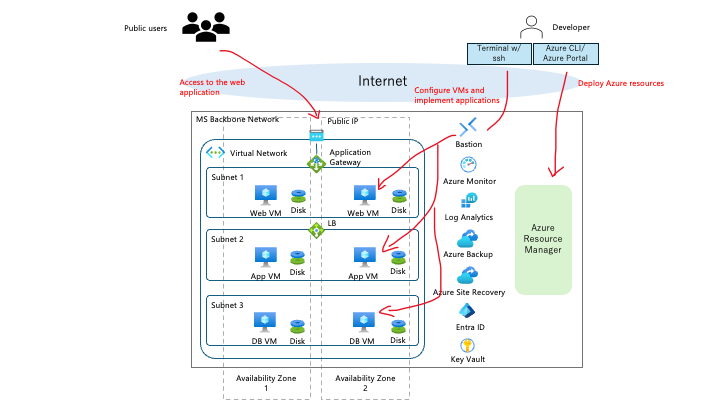

# Azure IaaS Workshop - Multi-User Blog Application

Japanese version: [README.ja.md](./README.ja.md)

This repository contains a 2-day hands-on workshop for learning resilient Azure IaaS patterns by building a highly available 3-tier web application.

## Where To Start

| Audience | Entry Point | Purpose |
|---|---|---|
| Learners | [Learner portal](https://hironariy.github.io/Azure-IaaS-Workshop/en/) or [Markdown portal](materials/docs/en/learner-portal.md) | Follow the Day 0, Day 1, and Day 2 workshop flow |
| Instructors / TAs | [WorkshopPlan.md](WorkshopPlan.md) | Review the agenda, success criteria, and support points |
| Content and app developers | [Local development guide](materials/docs/en/local-development-guide.md) and [design/](design/) | Maintain or extend the application, Bicep, and workshop materials |

In a copied repository with GitHub Pages enabled, the public URL is usually `https://<OWNER>.github.io/<REPOSITORY>/`. If Pages is not configured, learners can still use the [Markdown portal](materials/docs/en/learner-portal.md) directly on GitHub.

## Learner Quick Links

| Order | Page | Purpose |
|---|---|---|
| 1 | [Learner quickstart](materials/docs/en/learner/learner-quickstart.md) | Confirm the workshop flow and what to read first |
| 2 | [Day 0: Prerequisites](materials/docs/en/learner/day-0-prerequisites.md) | Check Azure Portal, Cloud Shell, Entra ID, quota, and GitHub repository readiness |
| 3 | [Day 1: Azure resource deployment](materials/docs/en/learner/day-1-deployment-checklist.md) | Prepare Cloud Shell, deploy Bicep, run post-deployment setup, configure DCR, and collect the FQDN |
| 4 | [Day 1: Application deployment](materials/docs/en/learner/day-1-app-deployment.md) | Place backend and frontend code on App/Web VMs and validate traffic |
| 5 | [Monitoring guide](materials/docs/en/operations/monitoring-guide.md) | Check Azure Monitor and Log Analytics |
| 6 | [Day 2: Resiliency checklist](materials/docs/en/learner/day-2-resiliency-checklist.md) | Practice Azure Backup, restore checks, HA validation, and ASR/test failover concepts |
| 7 | [Disaster recovery guide](materials/docs/en/operations/disaster-recovery-guide.md) | Review BCDR concepts, safety rules, and expected outcomes |
| 8 | [Azure Cloud Shell mini guide](materials/docs/en/learner/azure-cloud-shell-guide.md) | Confirm Cloud Shell Bash startup and basic operations |
| 9 | [Troubleshooting runbook](materials/docs/en/operations/troubleshooting-runbook.md) | Diagnose common deployment, app, monitoring, and resiliency issues |
| 10 | [Quick reference](materials/docs/en/reference/quick-reference-card.md) | Look up resource names, ports, commands, and KQL |

For the standard workshop path, learners do not need to install Azure CLI, Azure PowerShell, Bicep CLI, OpenSSL, Node.js, or Docker on their local computers. CLI and script work is standardized on Azure Cloud Shell Bash.

## Workshop Overview

### Target Audience

- Engineers with AWS design or operations experience who want practical Azure IaaS patterns
- Learners around the AZ-900 to AZ-104 level
- Teams who want to practice 3-tier web apps, monitoring, backup, and disaster recovery on Azure

### What You Will Learn

| Topic | Main Azure Services |
|---|---|
| High availability | Availability Zones, Application Gateway, Standard Load Balancer |
| Networking | Virtual Network, Subnet, NSG, NAT Gateway, Azure Bastion |
| Compute | Virtual Machines, Managed Disks |
| Identity | Microsoft Entra ID, Azure RBAC, Managed Identity |
| Infrastructure as Code | Bicep |
| Monitoring | Azure Monitor, Log Analytics, Azure Monitor Agent |
| BCDR | Azure Backup, Azure Site Recovery |

## Sample Application

The sample is a multi-user blog platform secured with Microsoft Entra ID.

| Layer | Technology |
|---|---|
| Frontend | React 18, TypeScript, TailwindCSS, Vite |
| Backend | Node.js 20, Express.js, TypeScript |
| Database | MongoDB 7.0 replica set |
| Authentication | Microsoft Entra ID + MSAL.js |

Main features:

- Browse public blog posts
- Create, edit, and delete posts as an authenticated user
- Manage user profiles

## Azure Architecture

In this workshop, the Web, App, and DB tiers run on Azure VMs. Learners practice Availability Zones, load balancing, Bastion access, monitoring, backup, and disaster recovery concepts around that IaaS environment.

## Repository Structure

| Path | Contents |
|---|---|
| `materials/docs/` | Learner materials and supplemental guides |
| `materials/bicep/` | Bicep templates for the Azure IaaS environment |
| `materials/frontend/` | React frontend source |
| `materials/backend/` | Express backend source |
| `design/` | Architecture, backend, frontend, database, and cross-cutting design docs |
| `scripts/` | SSL certificate, post-deployment setup, and monitoring helper scripts |
| `.github/workflows/pages.yml` | GitHub Actions-based Pages publication for the learner portal |

## For Developers

If you want to run or modify the application locally, see the [local development guide](materials/docs/en/local-development-guide.md). This is optional developer material, not the standard learner deployment path.

To understand the Bicep structure, see the [Bicep techniques guide](materials/docs/en/bicep-techniques-guide.md) and [materials/bicep/README.md](materials/bicep/README.md).

## GitHub Pages Publication

This repository uses GitHub Actions-based Pages. Repository administrators should set **Settings > Pages > Source** to **GitHub Actions**. Changes under `materials/docs/**` or `assets/**` on the `main` branch trigger a Pages build and publish the learner portal.

## License

This project is licensed under the [MIT License](LICENSE).