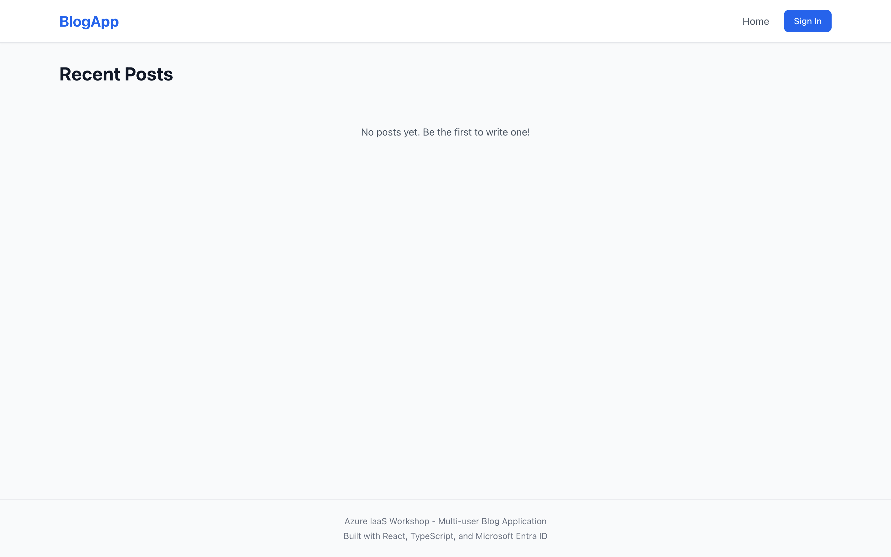
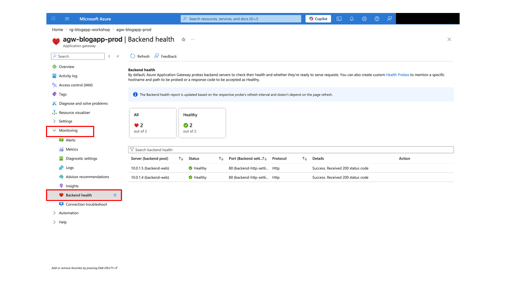

# Day 1: Application Deployment

## What You Do On This Page

Manually place Backend API and Frontend code on the App and Web VMs created in [Day 1: Azure resource deployment](day-1-deployment-checklist.md). You connect through Bastion, then verify, clone, build, start, deploy, and validate from inside each VM.

| Item | Details |
|---|---|
| Audience | Learners who completed Day 1 Azure resource deployment |
| Time | 45-75 minutes |
| Prerequisites | `RESOURCE_GROUP`, `FQDN`, Bastion extension, SSH key, and redirect URI update are ready |
| Done When | Backend API is PM2 `online` on both App VMs, Frontend is placed in the NGINX root on both Web VMs, and the app loads through Application Gateway |

## 0. Check Variables And Prerequisites

```bash
cd ~/Azure-IaaS-Workshop

RESOURCE_GROUP="rg-blogapp-workshop"
```

For multiple groups, use the instructor-assigned value, such as:

```bash
RESOURCE_GROUP="rg-blogapp-A-workshop"
```

Collect the FQDN again.

```bash
FQDN=$(az network public-ip show \
  --resource-group "$RESOURCE_GROUP" \
  --name pip-agw-blogapp-prod \
  --query dnsSettings.fqdn -o tsv)

echo "https://$FQDN"
```

Check Bastion and SSH prerequisites.

```bash
az extension show --name bastion --query "{name:name,version:version}" -o table
ls -l ~/.ssh/id_rsa ~/.ssh/id_rsa.pub
```

**Checkpoint:** `az network bastion ssh -h` should show help, and `~/.ssh/id_rsa` should exist. If Cloud Shell was reconnected, restore keys using the [troubleshooting runbook](../operations/troubleshooting-runbook.md).

## 1. Confirm Repository URL And VM Names

Set the URL of your Day 0 repository copy.

```bash
REPOSITORY_URL="https://github.com/<YOUR_GITHUB_USER>/Azure-IaaS-Workshop.git"
git remote -v
```

Confirm VM names.

```bash
APP_VMS=("vm-app-az1-prod" "vm-app-az2-prod")
WEB_VMS=("vm-web-az1-prod" "vm-web-az2-prod")
printf '%s\n' "${APP_VMS[@]}" "${WEB_VMS[@]}"
```

**Checkpoint:** The VMs must be able to clone `REPOSITORY_URL`. Private repositories require GitHub authentication and can slow down the workshop.

## 2. Connect To Each App VM Through Bastion

Start with `vm-app-az1-prod`.

```bash
az network bastion ssh \
  --name bastion-blogapp-prod \
  --resource-group "$RESOURCE_GROUP" \
  --target-resource-id "$(az vm show -g "$RESOURCE_GROUP" -n vm-app-az1-prod --query id -o tsv)" \
  --auth-type ssh-key \
  --username azureuser \
  --ssh-key ~/.ssh/id_rsa
```

Run Steps 3-7 inside the connected App VM. Then run `exit`, connect to `vm-app-az2-prod`, and repeat Steps 3-7.

```bash
az network bastion ssh \
  --name bastion-blogapp-prod \
  --resource-group "$RESOURCE_GROUP" \
  --target-resource-id "$(az vm show -g "$RESOURCE_GROUP" -n vm-app-az2-prod --query id -o tsv)" \
  --auth-type ssh-key \
  --username azureuser \
  --ssh-key ~/.ssh/id_rsa
```

## 3. Check Node.js, PM2, And Environment Variables

Run inside the connected App VM.

```bash
node --version
pm2 --version
pm2 list
ls -la /opt/blogapp/
```

Check non-secret environment values. Redact the MongoDB password.

```bash
grep -E '^(NODE_ENV|PORT|LOG_LEVEL|ENTRA_TENANT_ID|ENTRA_CLIENT_ID)=' /opt/blogapp/.env
grep '^MONGODB_URI=' /opt/blogapp/.env | sed 's#://blogapp:[^@]*@#://blogapp:***@#'
```

## 4. Remove The Temporary Health Process

Bicep creates `blogapp-health` only for temporary App tier health checks.

```bash
pm2 list
pm2 delete blogapp-health 2>/dev/null || true
pm2 save
pm2 list
```

## 5. Place Backend API Code

Run inside the connected App VM.

```bash
REPOSITORY_URL="https://github.com/<YOUR_GITHUB_USER>/Azure-IaaS-Workshop.git"

cd /opt/blogapp
rm -rf temp
git clone "$REPOSITORY_URL" temp
cp -r temp/materials/backend/* ./
rm -rf temp
```

**Checkpoint:** `package.json`, `src/`, and `tsconfig.json` are in `/opt/blogapp`.

## 6. Build And Start The Backend API

Run inside the connected App VM.

```bash
cd /opt/blogapp

# NODE_ENV=production is set, so install devDependencies needed for TypeScript build explicitly.
npm ci --include=dev
npm run build

# The backend reads dist/.env after build.
cp /opt/blogapp/.env /opt/blogapp/dist/.env
chmod 600 /opt/blogapp/dist/.env

pm2 delete blogapp-api 2>/dev/null || true
pm2 start dist/src/app.js --name blogapp-api
pm2 save

pm2 list
pm2 logs blogapp-api --lines 20
```

**Expected Result:** `blogapp-api` is `online` in PM2. Press `Ctrl+C` if logs keep streaming.

## 7. Validate Backend API Inside The App VM

```bash
curl http://localhost:3000/health
curl http://localhost:3000/api/posts
curl http://10.0.2.10:3000/health
```

**Expected Result:** Health returns `healthy`, and `/api/posts` returns a JSON array.

## 8. Connect To Each Web VM Through Bastion

Start with `vm-web-az1-prod`.

```bash
az network bastion ssh \
  --name bastion-blogapp-prod \
  --resource-group "$RESOURCE_GROUP" \
  --target-resource-id "$(az vm show -g "$RESOURCE_GROUP" -n vm-web-az1-prod --query id -o tsv)" \
  --auth-type ssh-key \
  --username azureuser \
  --ssh-key ~/.ssh/id_rsa
```

Run Steps 9-12 inside the connected Web VM. Then run `exit`, connect to `vm-web-az2-prod`, and repeat Steps 9-12.

```bash
az network bastion ssh \
  --name bastion-blogapp-prod \
  --resource-group "$RESOURCE_GROUP" \
  --target-resource-id "$(az vm show -g "$RESOURCE_GROUP" -n vm-web-az2-prod --query id -o tsv)" \
  --auth-type ssh-key \
  --username azureuser \
  --ssh-key ~/.ssh/id_rsa
```

## 9. Check NGINX And Runtime Config

Run inside the connected Web VM.

```bash
sudo systemctl status nginx --no-pager
nginx -v
curl http://localhost/health
cat /var/www/html/config.json
grep "proxy_pass" /etc/nginx/sites-available/default
```

**Checkpoint:** `config.json` is required by the frontend. Preserve it during static file deployment.

## 10. Build The Frontend

Run inside the connected Web VM.

```bash
REPOSITORY_URL="https://github.com/<YOUR_GITHUB_USER>/Azure-IaaS-Workshop.git"

cd /tmp
rm -rf temp
git clone "$REPOSITORY_URL" temp

if ! command -v node >/dev/null 2>&1; then
  curl -fsSL https://deb.nodesource.com/setup_20.x | sudo -E bash -
  sudo apt-get install -y nodejs
fi

cd temp/materials/frontend
npm ci
npm run build
```

**Expected Result:** `dist/` is created.

## 11. Deploy Frontend Static Files To NGINX

```bash
sudo cp /var/www/html/config.json /tmp/config.json.bak
sudo rm -rf /var/www/html/*
sudo cp -r dist/* /var/www/html/
sudo cp /tmp/config.json.bak /var/www/html/config.json
sudo chown -R www-data:www-data /var/www/html/

cd /tmp
rm -rf temp

ls -l /var/www/html/index.html /var/www/html/config.json
```

**Checkpoint:** Both `index.html` and `config.json` must exist.

## 12. Validate NGINX And API Proxy Inside The Web VM

```bash
sudo nginx -t
sudo systemctl reload nginx

curl http://localhost/health
curl -s http://localhost/ | head -5
curl http://localhost/api/posts
curl -s http://localhost/login | head -5
```

**Expected Result:** `/` and `/login` return HTML, and `/api/posts` returns JSON.

## 13. Validate The App Through Application Gateway

Run from Cloud Shell after both App VMs and both Web VMs are configured.

```bash
curl -k -I "https://$FQDN/"
curl -k "https://$FQDN/api/posts"
```

Open `https://$FQDN` in a browser.


*Sample app home screen*

**Expected Result:** The blog app appears after you pass the self-signed certificate warning, and `/api/posts` returns JSON.

## 14. Check Application Gateway Backend Health

Open Application Gateway in Azure Portal and check Backend health.


*Application Gateway backend health screen*

**Expected Result:** The expected Web tier backends are Healthy.

## Common Failures

| Symptom | Main Cause | Check |
|---|---|---|
| `git clone` fails | Wrong URL, template source URL, or private repository | Use your Day 0 repository copy and confirm unauthenticated clone works from the VMs |
| `/` returns `403 Forbidden` | Frontend `index.html` is missing | Step 11 succeeded on both Web VMs |
| `/api/posts` returns `502` or `504` | Backend is not running or MongoDB connection fails | PM2 status, backend logs, and MongoDB password alignment |
| `config.json` is missing | It was overwritten during static file deployment | Restore it from backup or rerun the web VM setup path |
| Login fails | SPA redirect URI or API permission is missing | Day 0 API permission and Day 1 resource Step 12 |

## Completion Criteria

- Backend API is deployed to both App VMs and `blogapp-api` is running in PM2.
- App VM `/health` and `/api/posts` checks work.
- Frontend is deployed to both Web VMs, with both `index.html` and `config.json` present.
- Web VM `/`, `/login`, and `/api/posts` checks work.
- Application Gateway can reach the app.
- Application Gateway backend health is checked.

## Next

Use the [monitoring guide](../operations/monitoring-guide.md) for the Day 1 monitoring exercise.

Previous page: [Day 1: Azure resource deployment](day-1-deployment-checklist.md)

When stuck: [Learner portal](../index.md) / [Troubleshooting runbook](../operations/troubleshooting-runbook.md) / [Quick reference](../reference/quick-reference-card.md)