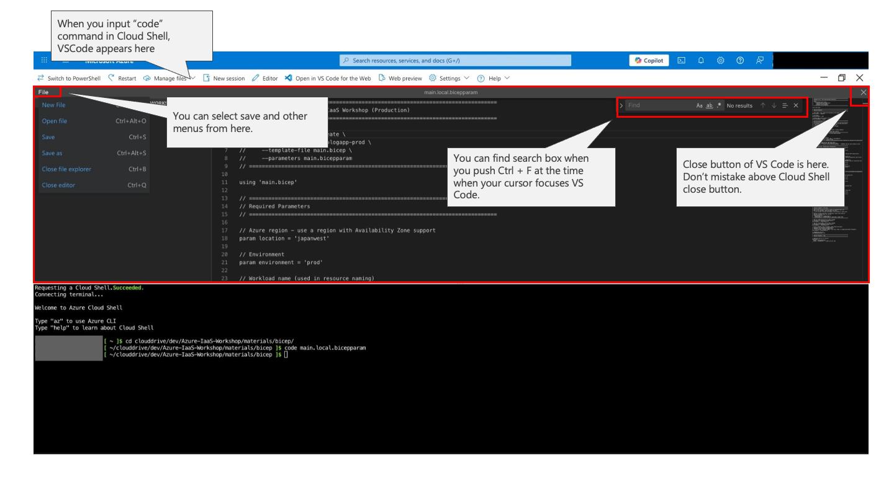
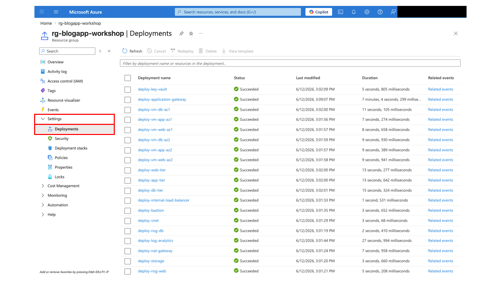

# Day 1: Azure Resource Deployment

## What You Do On This Page

Use Azure Cloud Shell Bash to prepare the workshop repository, create Bicep parameters, deploy the Azure IaaS environment, run MongoDB post-deployment setup, configure the Data Collection Rule, collect the Application Gateway FQDN, and update the Frontend SPA redirect URI.

| Item | Details |
|---|---|
| Audience | Learners who completed Day 0 prerequisites |
| Time | 45-75 minutes |
| Prerequisites | Cloud Shell Bash, Entra ID app registration values, VM quota, GitHub repository copy |
| Done When | Bicep deployment is `Succeeded`, post-deployment setup and DCR configuration are complete, the FQDN is known, and the SPA redirect URI is updated |

## 0. Open Cloud Shell Bash And Prepare The Repository

1. Sign in to Azure Portal.
2. Select the Cloud Shell icon in the top bar.
3. Select **Bash**.
4. If first-time storage setup appears, follow the instructor's guidance.

Clone the repository copy you created on Day 0. If it is already cloned, just change into the directory.

```bash
cd ~
if [ ! -d Azure-IaaS-Workshop ]; then
  git clone https://github.com/<OWNER>/Azure-IaaS-Workshop.git
fi
cd ~/Azure-IaaS-Workshop
```

Set working variables. Recreate them whenever Cloud Shell restarts.

```bash
LOCATION="japanwest"
RESOURCE_GROUP="rg-blogapp-workshop"
```

If multiple groups share one subscription, use the resource group name assigned by the instructor, such as `rg-blogapp-A-workshop`.

**Expected Result:** You can explain which resource group and region you will use.

## 1. Check Azure CLI Context

```bash
az account show --query "{subscription:name, subscriptionId:id, tenantId:tenantId}" -o table
```

**Checkpoint:** Confirm that the Tenant ID matches the value recorded on Day 0.

## 2. Prepare SSH Keys

Create an SSH key in Cloud Shell if one does not already exist.

```bash
ssh-keygen -t rsa -b 4096 -C "workshop@azure"
cat ~/.ssh/id_rsa.pub
```

Back up the keys to persistent Cloud Shell storage so you can restore them after reconnecting.

```bash
mkdir -p ~/clouddrive/workshop-keys
cp ~/.ssh/id_rsa ~/.ssh/id_rsa.pub ~/clouddrive/workshop-keys/
chmod 600 ~/clouddrive/workshop-keys/id_rsa
```

**Checkpoint:** Paste only the public key into Bicep parameters. Never push private keys to GitHub.

## 3. Generate The SSL Certificate

```bash
chmod +x scripts/generate-ssl-cert.sh
./scripts/generate-ssl-cert.sh
ls -l cert.pfx cert-base64.txt
```

**Expected Result:** `cert.pfx` and `cert-base64.txt` are created.

**Checkpoint:** The PFX password must match `sslCertificatePassword`; the script default is `Workshop2024!`. Browser warnings are expected because this is a self-signed certificate.

## 4. Create The Bicep Parameter File

```bash
cd materials/bicep
cp main.bicepparam main.local.bicepparam
code main.local.bicepparam
```


*Cloud Shell VS Code editor*

Set at least these values.

| Parameter | Value | How To Get It |
|---|---|---|
| `sshPublicKey` | Public key created in Cloud Shell | `cat ~/.ssh/id_rsa.pub` |
| `adminObjectId` | Your Entra object ID | Day 0 |
| `entraTenantId` | Tenant ID | Day 0 |
| `entraClientId` | Backend API Client ID | Day 0 |
| `entraFrontendClientId` | Frontend SPA Client ID | Day 0 |
| `sslCertificateData` | Base64 PFX contents | `cat ../../cert-base64.txt` |
| `sslCertificatePassword` | PFX password | Default `Workshop2024!` |
| `mongoDbAppPassword` | MongoDB app user password | Must exactly match Step 9's `<YOUR_MONGODB_APP_PASSWORD>` |
| `appGatewayDnsLabel` | Unique DNS label | Example: `blogapp-team1-0106` |

> [!IMPORTANT]
> `mongoDbAppPassword` must exactly match `<YOUR_MONGODB_APP_PASSWORD>` in `post-deployment-setup.local.sh`. If they differ, the Backend API cannot connect to MongoDB.
>
> Do not use `@` in `mongoDbAppPassword`. `@` is reserved in connection strings and breaks the generated `MONGODB_URI`.

For multiple groups, also set `groupId`.

```bicep
param groupId = 'A'
```

**Checkpoint:** `main.local.bicepparam` is ignored by Git. Do not push it.

## 5. Create The Resource Group

```bash
cd ~/Azure-IaaS-Workshop

az group create \
  --name "$RESOURCE_GROUP" \
  --location "$LOCATION"
```

## 6. Run The Bicep Deployment

```bash
az deployment group create \
  --resource-group "$RESOURCE_GROUP" \
  --template-file materials/bicep/main.bicep \
  --parameters materials/bicep/main.local.bicepparam
```

Deployment can take 15-30 minutes.

**Expected Result:** The final output includes `"provisioningState": "Succeeded"`.

**Checkpoint:** If the command appears quiet, do not cancel immediately. Check progress in Azure Portal.

## 7. Check Deployment Progress In Azure Portal

1. Open Azure Portal > Resource groups.
2. Open your resource group.
3. Open **Deployments**.
4. Check `main` or the active deployment.


*Checking deployment progress from Resource group Deployments*

## 8. Prepare The Bastion Extension

Post-deployment setup and application deployment use `az network bastion ssh`.

```bash
az config set extension.use_dynamic_install=yes_without_prompt
az extension add --name bastion --upgrade --yes
az extension show --name bastion --query "{name:name,version:version}" -o table
```

**Checkpoint:** `az network bastion ssh -h` should show help.

## 9. Run Post-Deployment Setup

Initialize the MongoDB replica set and users.

```bash
cd ~/Azure-IaaS-Workshop/scripts
cp post-deployment-setup.template.sh post-deployment-setup.local.sh
chmod +x post-deployment-setup.local.sh
code post-deployment-setup.local.sh
```

Replace the placeholders.

| Placeholder | Example |
|---|---|
| `<YOUR_RESOURCE_GROUP>` | Value of `$RESOURCE_GROUP` |
| `<YOUR_BASTION_NAME>` | `bastion-blogapp-prod` |
| `<PATH_TO_YOUR_SSH_KEY>` | `~/.ssh/id_rsa` |
| `<YOUR_MONGODB_ADMIN_PASSWORD>` | Admin password you choose |
| `<YOUR_MONGODB_APP_PASSWORD>` | Same value as `mongoDbAppPassword` from Step 4 |

Run the script.

```bash
./post-deployment-setup.local.sh "$RESOURCE_GROUP"
```

**Expected Result:** MongoDB replica set initialization and user creation succeed.

**Checkpoint:** Password mismatch or a password containing `@` will prevent the backend from connecting to MongoDB.

## 10. Configure The Data Collection Rule

```bash
cd ~/Azure-IaaS-Workshop
chmod +x scripts/configure-dcr.sh
./scripts/configure-dcr.sh "$RESOURCE_GROUP"
```

**Expected Result:** A DCR for Syslog and Perf collection is created and associated with VMs.

**Checkpoint:** New Log Analytics workspaces may need 1-5 minutes to initialize tables. Wait and rerun if needed.

## 11. Get The Application Gateway FQDN

```bash
FQDN=$(az network public-ip show \
  --resource-group "$RESOURCE_GROUP" \
  --name pip-agw-blogapp-prod \
  --query dnsSettings.fqdn -o tsv)

echo "https://$FQDN"
```

## 12. Update The Frontend SPA Redirect URI

Open the Frontend SPA app registration in Azure Portal.

1. Open Microsoft Entra ID > App registrations > `BlogApp Frontend <your name or team name>`.
2. Open **Authentication**.
3. Add these Redirect URIs under Single-page application:
   - `https://<YOUR_FQDN>`
   - `https://<YOUR_FQDN>/`
4. Save.

**Checkpoint:** Keep `http://localhost:5173` for local development if needed. Day 1 requires the `https://<YOUR_FQDN>` redirect URI.

## Common Failures

| Symptom | Check |
|---|---|
| VM SKU is unavailable | `az vm list-skus --location japanwest --size Standard_B -o table` |
| DNS label is already used | Choose a unique `appGatewayDnsLabel` |
| Deployment fails | Resource group > Deployments > failed operation details |
| MongoDB connection fails later | `mongoDbAppPassword` matches post-deployment setup and does not contain `@` |
| `az network bastion ssh` is missing | Bastion extension is installed and updated |
| Cloud Shell reconnect breaks SSH | Restore keys from `~/clouddrive/workshop-keys` |
| Log Analytics has no data | DCR is configured and enough time has passed |

## Completion Criteria

- Repository is cloned in Cloud Shell.
- SSH key and SSL certificate are created.
- `main.local.bicepparam` is configured.
- Bicep deployment is `Succeeded`.
- Bastion extension is ready.
- Post-deployment setup is complete.
- DCR is configured.
- Application Gateway FQDN is collected.
- Frontend SPA redirect URI is updated.

## Next

Continue to [Day 1: Application deployment](day-1-app-deployment.md).

Previous page: [Day 0: Prerequisites](day-0-prerequisites.md)

When stuck: [Learner portal](../index.md) / [Troubleshooting runbook](../operations/troubleshooting-runbook.md) / [Quick reference](../reference/quick-reference-card.md)