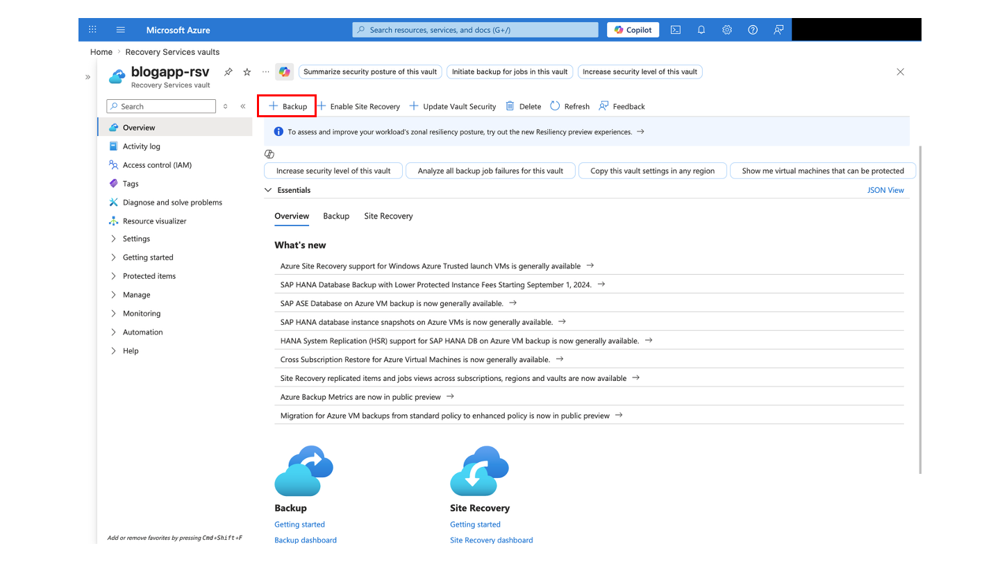
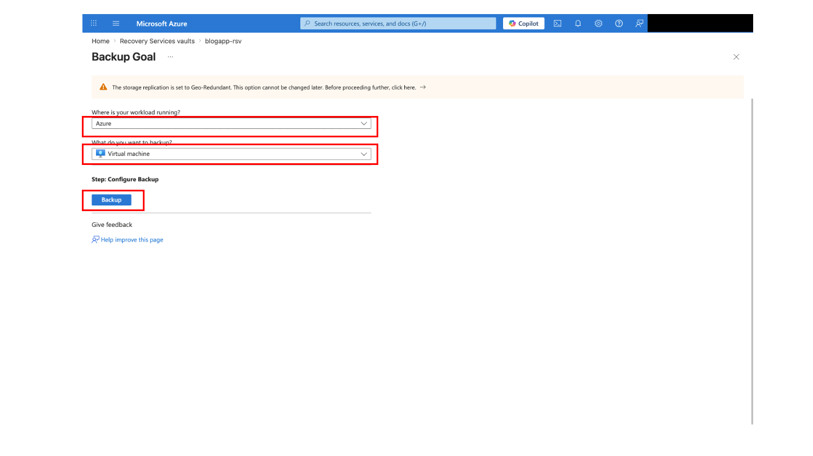
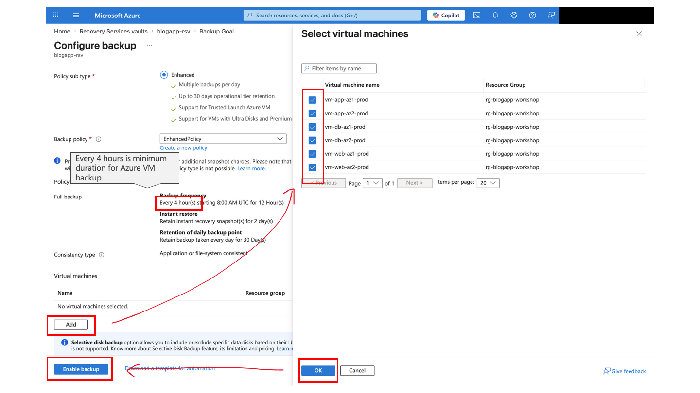
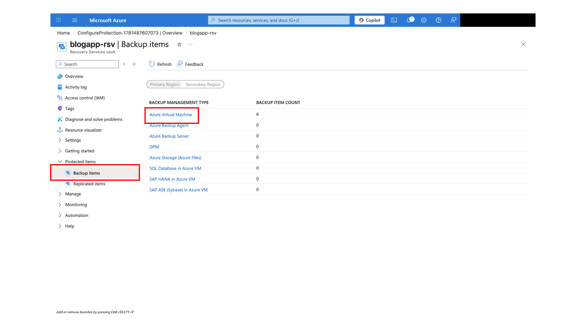
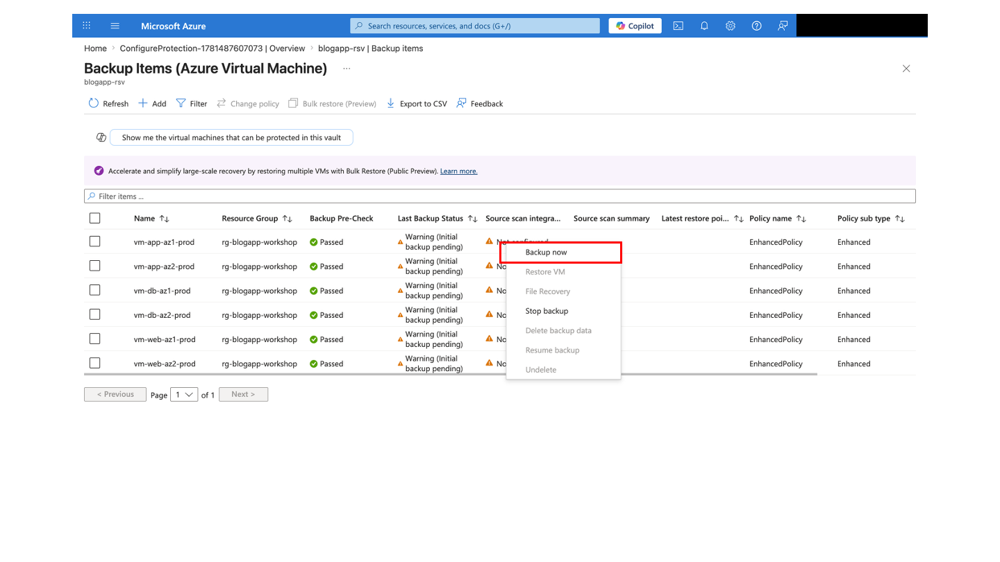

# Day 2: Resiliency Checklist

## What You Do On This Page

Use the Azure IaaS environment from Day 1 to review Azure Backup, HA behavior during VM failures, and Azure Site Recovery (ASR) test failover concepts. Backup, Restore, and ASR are mainly Azure Portal operations; VM stop/start and status checks use Azure Cloud Shell Bash.

| Item | Details |
|---|---|
| Audience | Learners who completed Day 1 deployment and application validation |
| Time | 90-150 minutes |
| Prerequisites | Day 1 environment is running, the app is reachable through Application Gateway, and Cloud Shell Bash is available |
| Done When | You can explain backup capture, restore point checks, Web/App/DB failure behavior, ASR replication/test failover concepts, and cleanup safety |

## Safety Rules

- Run failure tests only when the instructor says to begin.
- Start any stopped VM again before leaving each exercise.
- Backup, Restore, and ASR can take time and cost money; remove unnecessary test failover resources.
- Before stopping DB VMs, confirm test data and current application health.
- ASR initial replication can take a long time. If test failover does not fit workshop time, switch to instructor demo or design walkthrough.

## 0. Confirm Variables And Day 1 Environment

```bash
cd ~/Azure-IaaS-Workshop

RESOURCE_GROUP="rg-blogapp-workshop"
FQDN=$(az network public-ip show \
  --resource-group "$RESOURCE_GROUP" \
  --name pip-agw-blogapp-prod \
  --query dnsSettings.fqdn -o tsv)

echo "https://$FQDN"
az vm list --resource-group "$RESOURCE_GROUP" -o table
```

**Expected Result:** `vm-web-az1-prod`, `vm-web-az2-prod`, `vm-app-az1-prod`, `vm-app-az2-prod`, `vm-db-az1-prod`, and `vm-db-az2-prod` are listed.

**Checkpoint:** In multiple-group setups, VM names stay the same; only the resource group changes. Always pass `--resource-group "$RESOURCE_GROUP"`.

## 1. Create Test Data

1. Open `https://$FQDN` in a browser.
2. Pass the self-signed certificate warning.
3. Sign in and create one test post.
4. Record the post title, time, and author.

**Expected Result:** You have test data to compare after backup/restore or failure validation.

**Checkpoint:** Do not put personal or confidential information in test posts.

## 2. Create A Recovery Services Vault

Day 1 Bicep does not create Recovery Services vault, Azure Backup, or ASR resources. Create the vault in Azure Portal.

1. Search for **Recovery Services vaults** in Azure Portal.
2. Select **Create**.
3. Use the same subscription and resource group as Day 1.
4. Use a name such as `rsv-blogapp-workshop`.
5. Use the same region as Day 1 `LOCATION`.
6. Review and create.

**Expected Result:** A Recovery Services vault is created.

**Checkpoint:** The `backups` container in the Bicep-created storage account is different from Recovery Services vault. Azure VM Backup and ASR are managed from Recovery Services vault.

## 3. Enable Azure Backup

1. Open the Recovery Services vault.
2. Select **Backup**.
3. Use **Azure** as workload location and **Virtual machine** as workload type.
4. Create or select a short-retention policy for the workshop.
5. Select target VMs. If time is limited, use only the representative VM specified by the instructor.
6. Enable backup.


*Recovery Services vault home screen*


*Azure Backup configuration screen 1*


*Azure Backup configuration screen 2*

**Expected Result:** Target VMs appear as backup items.

**Checkpoint:** Initial backup can take time.

## 4. Run On-Demand Backup

1. Open Recovery Services vault > Backup items.
2. Select the target VM.
3. Run **Backup now**.
4. Check progress in Backup jobs.


*On-demand backup step 1*


*On-demand backup step 2*

**Expected Result:** The backup job becomes `Completed`.

## 5. Check Restore Points

1. Open the target backup item.
2. Open **Restore VM** or **Restore points**.
3. Confirm that a recent restore point exists.

**Checkpoint:** In production-like scenarios, restore to a new VM or separate resource group for validation; do not overwrite the existing VM casually.

## 6. Review Restore Operation

Run Restore VM only when the instructor tells you to and when time and permissions allow it. If time is limited, reviewing restore points and restore screens is enough.

**Expected Result:** You can explain destination VM, network, storage, and VM name choices.

**Checkpoint:** If you create a restored VM, record it for cleanup.

## 7. Validate Web VM Failure Behavior

```bash
az network application-gateway show-backend-health \
  --resource-group "$RESOURCE_GROUP" \
  --name agw-blogapp-prod \
  --query "backendAddressPools[].backendHttpSettingsCollection[].servers[].{address:address,health:health}" \
  -o table

az vm stop --resource-group "$RESOURCE_GROUP" --name vm-web-az1-prod

curl -k "https://$FQDN/"

az network application-gateway show-backend-health \
  --resource-group "$RESOURCE_GROUP" \
  --name agw-blogapp-prod \
  --query "backendAddressPools[].backendHttpSettingsCollection[].servers[].{address:address,health:health}" \
  -o table

az vm start --resource-group "$RESOURCE_GROUP" --name vm-web-az1-prod
```

**Expected Result:** The app still responds through the other Web VM.

**Checkpoint:** `az vm stop` simulates guest OS stop. Do not use `az vm deallocate` unless the instructor tells you to.

## 8. Validate App VM Failure Behavior

```bash
az vm stop --resource-group "$RESOURCE_GROUP" --name vm-app-az1-prod

curl -k "https://$FQDN/api/posts"

az vm start --resource-group "$RESOURCE_GROUP" --name vm-app-az1-prod
```

**Expected Result:** The API continues through the other App VM or recovers shortly.

## 9. Validate DB VM Failure Behavior

```bash
az vm stop --resource-group "$RESOURCE_GROUP" --name vm-db-az1-prod

curl -k "https://$FQDN/api/posts"

az vm start --resource-group "$RESOURCE_GROUP" --name vm-db-az1-prod
```

**Expected Result:** MongoDB replica set behavior can be observed, including primary election and recovery after the VM starts again.

**Checkpoint:** DB failure has higher impact than Web/App failure and may cause short write failures. Confirm both DB VMs are running after the exercise.

## 10. Confirm All VMs Are Running

```bash
az vm list \
  --resource-group "$RESOURCE_GROUP" \
  --show-details \
  --query "[].{name:name,powerState:powerState}" \
  -o table
```

Start any stopped VM.

```bash
az vm start --resource-group "$RESOURCE_GROUP" --name <VM_NAME>
```

## 11. Enable ASR Replication

ASR can take time, so this may be an instructor demo or a representative-VM exercise.

1. Open the Recovery Services vault.
2. Open **Site Recovery**.
3. Select **Enable replication**.
4. Select the Day 1 source resource group and region.
5. Select the instructor-specified target region.
6. Review target VNet/subnet mapping.
7. Select the representative VM or instructor-specified VMs.
8. Enable replication.

**Expected Result:** A replicated item is created, and initial replication starts or completes.

## 12. Review Test Failover

Test failover uses an isolated network to avoid production impact.

1. Open the replicated item or recovery plan.
2. Select **Test failover**.
3. Select a recovery point and test VNet.
4. Start test failover.
5. Review the test VM and network.
6. Run **Cleanup test failover** after validation.

**Checkpoint:** If you do not clean up test failover, extra test resources remain and can create cost and confusion.

## Completion Criteria

- Recovery Services vault is created.
- Backup is enabled for target VMs and restore points are visible.
- Web VM failure behavior is observed and the VM is started again.
- App VM failure behavior is observed and the VM is started again.
- DB VM failure impact and recovery behavior are discussed, and DB VMs are running again.
- ASR replication health and test failover concepts are explained.
- Test failover cleanup is complete if test failover was run.
- All 6 VMs are `VM running`.

## When Stuck

- Use the [troubleshooting runbook](../operations/troubleshooting-runbook.md) for symptom-based checks.
- Use the [quick reference](../reference/quick-reference-card.md) for commands and resource names.
- Use the [disaster recovery guide](../operations/disaster-recovery-guide.md) for BCDR background.

Previous page: [Monitoring guide](../operations/monitoring-guide.md)

Back to the [learner portal](../index.md)