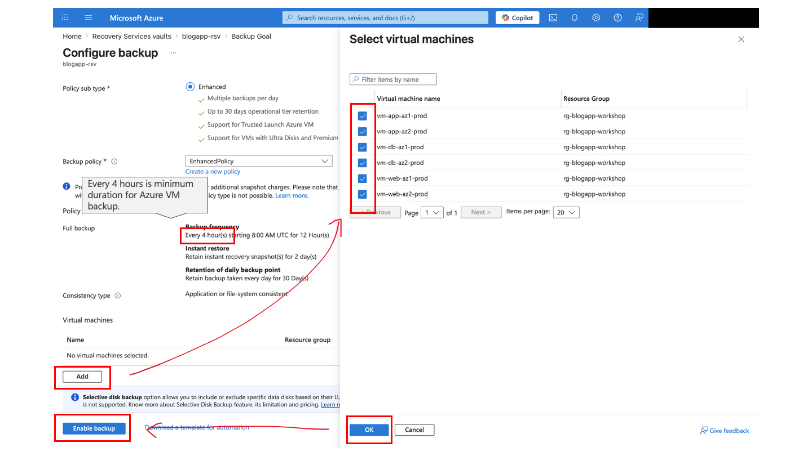

# Day 2: Resiliency Checklist

## What You Do On This Page

Use the Azure IaaS environment from Day 1 to review Azure Backup, HA behavior during VM failures, and Azure Site Recovery (ASR) test failover concepts. Backup, Restore, and ASR are mainly Azure Portal operations; VM stop/start and status checks use Azure Cloud Shell Bash.

| Item | Details |
|---|---|
| Audience | Learners who completed Day 1 deployment and application validation |
| Time | 90-150 minutes |
| Prerequisites | Day 1 environment is running, the app is reachable through Application Gateway, and Cloud Shell Bash is available |
| Done When | You can explain backup capture, restore point checks, Web/App/DB failure behavior, ASR replication/test failover concepts, and cleanup safety |

## Safety Rules

- Run failure tests only when the instructor says to begin.
- Start any stopped VM again before leaving each exercise.
- Backup, Restore, and ASR can take time and cost money; remove unnecessary test failover resources.
- Before stopping DB VMs, confirm test data and current application health.
- ASR initial replication can take a long time. If test failover does not fit workshop time, switch to instructor demo or design walkthrough.

## 0. Confirm Variables And Day 1 Environment

```bash
cd ~/Azure-IaaS-Workshop

RESOURCE_GROUP="rg-blogapp-workshop"
FQDN=$(az network public-ip show \
  --resource-group "$RESOURCE_GROUP" \
  --name pip-agw-blogapp-prod \
  --query dnsSettings.fqdn -o tsv)

echo "https://$FQDN"
az vm list --resource-group "$RESOURCE_GROUP" -o table
```

**Expected Result:** `vm-web-az1-prod`, `vm-web-az2-prod`, `vm-app-az1-prod`, `vm-app-az2-prod`, `vm-db-az1-prod`, `vm-db-az2-prod`, and `vm-db-az3-prod` (7 VMs) are listed.

**Checkpoint:** In multiple-group setups, VM names stay the same; only the resource group changes. Always pass `--resource-group "$RESOURCE_GROUP"`.

## 1. Create Test Data

1. Open `https://$FQDN` in a browser.
2. Pass the self-signed certificate warning.
3. Sign in and create one test post.
4. Record the post title, time, and author.

**Expected Result:** You have test data to compare after backup/restore or failure validation.

**Checkpoint:** Do not put personal or confidential information in test posts.

## 2. Create A Recovery Services Vault

Day 1 Bicep does not create Recovery Services vault, Azure Backup, or ASR resources. Create the vault in Azure Portal.

1. Search for **Recovery Services vaults** in Azure Portal.
2. Select **Create**.
3. Use the same subscription and resource group as Day 1.
4. Use a name such as `rsv-blogapp-workshop`.
5. Use the same region as Day 1 `LOCATION`.
6. Review and create.

**Expected Result:** A Recovery Services vault is created.

**Checkpoint:** The `backups` container in the Bicep-created storage account is different from Recovery Services vault. Azure VM Backup and ASR are managed from Recovery Services vault.

## 3. Enable Azure Backup

1. Open the Recovery Services vault.
2. Select **Backup**.
3. Use **Azure** as workload location and **Virtual machine** as workload type.
4. Create or select a short-retention policy for the workshop.
5. Select target VMs. If time is limited, use only the representative VM specified by the instructor.
6. Enable backup.


*Recovery Services vault home screen*


*Azure Backup configuration screen 1*


*Azure Backup configuration screen 2*

**Expected Result:** Target VMs appear as backup items.

**Checkpoint:** Initial backup can take time.

## 4. Run On-Demand Backup

1. Open Recovery Services vault > Backup items.
2. Select the target VM.
3. Run **Backup now**.
4. Check progress in Backup jobs.


*On-demand backup step 1*


*On-demand backup step 2*

**Expected Result:** The backup job becomes `Completed`.

## 5. Check Restore Points

1. Open the target backup item.
2. Open **Restore VM** or **Restore points**.
3. Confirm that a recent restore point exists.

**Checkpoint:** In production-like scenarios, restore to a new VM or separate resource group for validation; do not overwrite the existing VM casually.

## 6. Review Restore Operation

Run Restore VM only when the instructor tells you to and when time and permissions allow it. If time is limited, reviewing restore points and restore screens is enough.

**Expected Result:** You can explain destination VM, network, storage, and VM name choices.

**Checkpoint:** If you create a restored VM, record it for cleanup.

## 7. Validate Web VM Failure Behavior

```bash
az network application-gateway show-backend-health \
  --resource-group "$RESOURCE_GROUP" \
  --name agw-blogapp-prod \
  --query "backendAddressPools[].backendHttpSettingsCollection[].servers[].{address:address,health:health}" \
  -o table

az vm stop --resource-group "$RESOURCE_GROUP" --name vm-web-az1-prod

curl -k "https://$FQDN/"

az network application-gateway show-backend-health \
  --resource-group "$RESOURCE_GROUP" \
  --name agw-blogapp-prod \
  --query "backendAddressPools[].backendHttpSettingsCollection[].servers[].{address:address,health:health}" \
  -o table

az vm start --resource-group "$RESOURCE_GROUP" --name vm-web-az1-prod
```

**Expected Result:** The app still responds through the other Web VM.

**Checkpoint:** `az vm stop` simulates guest OS stop. Do not use `az vm deallocate` unless the instructor tells you to.

## 8. Validate App VM Failure Behavior

```bash
az vm stop --resource-group "$RESOURCE_GROUP" --name vm-app-az1-prod

curl -k "https://$FQDN/api/posts"

az vm start --resource-group "$RESOURCE_GROUP" --name vm-app-az1-prod
```

**Expected Result:** The API continues through the other App VM or recovers shortly.

## 9. Validate Automatic Failover Of The DB Replica Set

The DB tier is a MongoDB replica set with three data-bearing members (`vm-db-az1` / `az2` / `az3` in Zones 1/2/3, no arbiter; Issue #30). Elections and `w=majority` writes need a majority of the three votes, which is **2**. Therefore, **any single node** can stop and the remaining two automatically elect a PRIMARY and keep accepting writes.

This exercise checks three things:

1. A new PRIMARY takes over in two ways: a **planned handover** (graceful mongod stop) and a **failure-driven election** (forced VM stop). Compare the **election time** and the **application recovery time**.
2. Stopping each SECONDARY one at a time does not interrupt reads or writes.
3. A stopped node rejoins and its data matches.

> **AWS comparison:** This behaves like a self-managed MongoDB replica set on three EC2 instances in three AZs. With Amazon DocumentDB the service promotes a replica for you; here you observe the election mechanism yourself.

### 9.1 Prepare: Status Command And API Probe

In Cloud Shell, define a helper that prints replica set state. Run it against a DB VM that is not stopped. MongoDB requires authentication (Issue #36), so first enter the password of the admin user `blogadmin` (`<YOUR_MONGODB_ADMIN_PASSWORD>` from Day 1). The input is not echoed and is kept only in a variable of this Cloud Shell session. Section 9.5 reuses the same variable.

```bash
read -rsp 'MongoDB admin password: ' MONGO_ADMIN_PASSWORD; echo
MONGO_AUTH="-u blogadmin -p '$MONGO_ADMIN_PASSWORD' --authenticationDatabase admin"
RS_STATUS='mongosh '"$MONGO_AUTH"' --quiet --eval "rs.status().members.forEach(m => print(m.name, m.stateStr, \"health=\" + m.health, m.electionDate ? \"elected=\" + m.electionDate.toISOString() : \"\"))"'
db_status() {
  az vm run-command invoke -g "$RESOURCE_GROUP" -n "$1" \
    --command-id RunShellScript --scripts "$RS_STATUS" \
    --query "value[0].message" -o tsv
}
db_status vm-db-az2-prod
```

**Expected Result:** One line shows `10.0.3.4:27017 PRIMARY`, and two lines show `SECONDARY` (`10.0.3.5`, `10.0.3.6`).

Start a background probe that calls the API every 5 seconds and logs the HTTP status (it stops by itself after about 15 minutes).

```bash
( for i in $(seq 1 180); do
    echo "$(date -u +%H:%M:%S) $(curl -k -s -o /dev/null -w '%{http_code}' --max-time 8 "https://$FQDN/api/posts")"
    sleep 5
  done ) > ~/db-failover-probe.log 2>&1 &
PROBE_PID=$!

# Helpers that classify the probe results
probe_failures() {
  grep -E ' (5[0-9][0-9]|000)$' ~/db-failover-probe.log | tail -20   # candidate DB/app failures
}
probe_summary() {
  awk '{print $2}' ~/db-failover-probe.log | sort | uniq -c           # count per status
}
```

**How to read the probe log:**

| Status | Meaning | Count as failure? |
|---|---|---|
| `200` | OK | — |
| `5xx` (`500`, `502`, `503`, `504`) | The API cannot read/write the DB, or no App VM answers | **Yes** |
| `000` | Timeout or connection failure | **Yes** |
| `429` | Backend rate limit (Too Many Requests) | **No** |

> **Why `429` is excluded:** the backend limits `/api` to **100 requests per 15 minutes per App VM** (`express-rate-limit` in `materials/backend/src/app.ts`, limit `RATE_LIMIT_MAX_REQUESTS`). The probe and your browser share that limit, so a shorter interval returns `429` even while the DB is healthy. A `429` is not a DB failure, so leave it out of the recovery-time calculation. In AWS terms, this is like telling API Gateway throttling (`429`) apart from ALB target failures (`502`/`503`).
>
> **Why not probe `/health`:** `https://$FQDN/health` is answered directly by NGINX on the Web VM for the Application Gateway probe and never reaches the App VMs or MongoDB. To observe a DB failover, probe `/api/posts`, which reads from the DB.

### 9.2 Planned Handover: Stop mongod On The PRIMARY Gracefully

`systemctl stop mongod` performs a **graceful shutdown**. Before it stops, the PRIMARY steps down by itself and hands over to a caught-up SECONDARY. Nothing has to *detect* a failure, so the election finishes almost immediately (under a second to a few seconds). This is the same operation you use to move the PRIMARY before maintenance or OS updates.

```bash
# T0 is when mongod stops inside the VM. Print the VM-side time so the
# Run Command delivery delay (about 10-20 seconds) is not counted in T0.
az vm run-command invoke -g "$RESOURCE_GROUP" -n vm-db-az1-prod \
  --command-id RunShellScript --scripts 'echo "T0=$(date -u +%H:%M:%S)"; sudo systemctl stop mongod' \
  --query "value[0].message" -o tsv
db_status vm-db-az2-prod
```

**Expected Result:** `10.0.3.5` or `10.0.3.6` becomes `PRIMARY` and shows the election time in `elected=`. `10.0.3.4` is `(not reachable/healthy)`.

In the browser, create a post and edit an existing post. Both succeed, with no app restart and no manual replica set reconfiguration.

```bash
probe_failures
probe_summary
```

Record:

- **Election time** = `elected=` time − T0 (typically **about 0 to a few seconds**: with a graceful stop the PRIMARY hands over by itself, so there is no `electionTimeoutMillis` wait)
- **App recovery time** = first `200` after the last `5xx`/`000` − T0. Often there is no `5xx`/`000` at all (no app impact); record that as "0 seconds (no errors)".

> **Common pitfall:** if you note T0 with `date` and then run `az vm run-command invoke`, `elected=` can look about 15 seconds later. That is the Run Command delivery delay, not the election. Use the `T0=` value printed inside the VM, as above.

Start mongod again.

```bash
az vm run-command invoke -g "$RESOURCE_GROUP" -n vm-db-az1-prod \
  --command-id RunShellScript --scripts "sudo systemctl start mongod"
sleep 30
db_status vm-db-az2-prod
```

**Expected Result:** `10.0.3.4` rejoins as `SECONDARY` and catches up from the oplog. After it catches up, `10.0.3.4` (priority 2) becomes `PRIMARY` again through a **short second election (priority takeover)**. The app also recovers within seconds of that election.

### 9.3 Failure-Driven Election: Force-Stop The PRIMARY VM

This simulates a sudden whole-host failure (power loss). `--skip-shutdown` powers the VM off immediately without shutting down the guest OS. mongod cannot step down, so the remaining two nodes elect a new PRIMARY only after they **detect the missing heartbeats**. Without `--skip-shutdown`, the OS shuts down cleanly and you get the same planned handover as in 9.2.

```bash
az vm stop --resource-group "$RESOURCE_GROUP" --name vm-db-az1-prod --skip-shutdown
db_status vm-db-az2-prod
```

**Expected Result:** One of the remaining two nodes becomes `PRIMARY`. Creating and editing posts in the browser succeeds.

Record:

- **T0** = time of the first `5xx`/`000` in the probe log (close to the power-off time; do not use the `az vm stop` start time, which includes Azure-side processing)
- **Election time** = `elected=` time − T0 (typically **about 10-15 seconds**: a SECONDARY starts an election after it gets no heartbeat from the PRIMARY for the default `electionTimeoutMillis` of 10 seconds)
- **App recovery time** = first `200` after the last `5xx`/`000` − T0 (typically election time plus a few seconds while the driver discovers the new PRIMARY)

**Comparing 9.2 and 9.3:** a planned handover (9.2) is almost zero-downtime, while a failure-driven election (9.3) stops writes for the detection wait (`electionTimeoutMillis`). That is the practical RTO of automatic failover. In AWS terms, it is the difference between an RDS Multi-AZ reboot with failover and an automatic failover after an AZ outage.

```bash
az vm start --resource-group "$RESOURCE_GROUP" --name vm-db-az1-prod
sleep 60
db_status vm-db-az2-prod
```

### 9.4 Stop Each SECONDARY One At A Time

```bash
az vm stop --resource-group "$RESOURCE_GROUP" --name vm-db-az2-prod
db_status vm-db-az1-prod
# create and edit a post in the browser
az vm start --resource-group "$RESOURCE_GROUP" --name vm-db-az2-prod
sleep 60
db_status vm-db-az1-prod

az vm stop --resource-group "$RESOURCE_GROUP" --name vm-db-az3-prod
db_status vm-db-az1-prod
# create and edit a post in the browser
az vm start --resource-group "$RESOURCE_GROUP" --name vm-db-az3-prod
sleep 60
db_status vm-db-az1-prod
```

**Expected Result:** Stopping a SECONDARY does not trigger an election; `10.0.3.4` stays PRIMARY. Creating and editing posts succeeds (PRIMARY + remaining SECONDARY = 2 votes, a majority). After starting, the stopped node returns as `SECONDARY` with `health=1`.

### 9.5 Confirm Data Matches After Rejoin

```bash
COUNT='mongosh '"$MONGO_AUTH"' --quiet --eval "db.getMongo().setReadPref(\"secondaryPreferred\"); print(db.getSiblingDB(\"blogapp\").posts.countDocuments())"'
for vm in vm-db-az1-prod vm-db-az2-prod vm-db-az3-prod; do
  echo "$vm: $(az vm run-command invoke -g "$RESOURCE_GROUP" -n $vm --command-id RunShellScript --scripts "$COUNT" --query "value[0].message" -o tsv | grep -E '^[0-9]+$')"
done
kill "$PROBE_PID" 2>/dev/null
```

**Expected Result:** All three nodes return the same count, including posts created during the exercise.

### 9.6 Losing Two Nodes Loses The Majority (Discussion Only)

> **Important:** If **two** of the three nodes stop, the remaining node holds only 1 of 3 votes and **cannot elect a PRIMARY**. It stays `SECONDARY`, and API writes fail (reads may also fail depending on read preference). This is correct MongoDB behavior: it prevents a minority side from accepting writes that would later be rolled back (split brain). The set recovers automatically when a second node returns. Do not use `rs.reconfig({force: true})` in normal operations; it is a last-resort DR step (see the [disaster recovery guide](../operations/disaster-recovery-guide.md)). Show this state only as an instructor demo; learners should not stop two DB nodes at the same time.

**Why no arbiter:** PRIMARY + SECONDARY + ARBITER (PSA) also has three votes. But when one data-bearing node stops, only one node still holds data. A `w=majority` write needs acknowledgment from two data-bearing members, so writes stall. With three data-bearing members (PSS), a single failure stops neither elections nor writes.

| Exercise | T0 | New PRIMARY | Election time stamp | Election time | App recovery time |
|---|---|---|---|---|---|
| 9.2 graceful mongod stop (planned handover) |  |  |  |  |  |
| 9.3 forced VM stop (failure-driven election) |  |  |  |  |  |

**Checkpoint:** After the exercise, confirm all three DB VMs are running and `db_status` shows one `PRIMARY` and two `SECONDARY` members.

## 10. Confirm All VMs Are Running

```bash
az vm list \
  --resource-group "$RESOURCE_GROUP" \
  --show-details \
  --query "[].{name:name,powerState:powerState}" \
  -o table
```

Start any stopped VM.

```bash
az vm start --resource-group "$RESOURCE_GROUP" --name <VM_NAME>
```

## 11. Enable ASR Replication

ASR can take time, so this may be an instructor demo or a representative-VM exercise.

1. Open the Recovery Services vault.
2. Open **Site Recovery**.
3. Select **Enable replication**.
4. Select the Day 1 source resource group and region.
5. Select the instructor-specified target region.
6. Review target VNet/subnet mapping.
7. Select the representative VM or instructor-specified VMs.
8. Check the extension update setting under advanced settings. With Owner or User Access Administrator, you can keep "Allow Site Recovery to manage". **With the Contributor role only, choose to manage updates manually** (the role assignment for the auto-update Automation account would fail; see Day 0 Step 3.1). If organization policy disables shared key access on Storage, the cache Storage account also needs role assignments (error 28176, see [troubleshooting runbook §10](../operations/troubleshooting-runbook.md#10-backup-or-asr-does-not-progress)).
9. Enable replication.

**Expected Result:** A replicated item is created, and initial replication starts or completes.

## 12. Review Test Failover

Test failover uses an isolated network to avoid production impact.

1. Open the replicated item or recovery plan.
2. Select **Test failover**.
3. Select a recovery point and test VNet.
4. Start test failover.
5. Review the test VM and network.
6. Run **Cleanup test failover** after validation.

**Checkpoint:** If you do not clean up test failover, extra test resources remain and can create cost and confusion.

## Completion Criteria

- Recovery Services vault is created.
- Backup is enabled for target VMs and restore points are visible.
- Web VM failure behavior is observed and the VM is started again.
- App VM failure behavior is observed and the VM is started again.
- Stopping the DB PRIMARY triggers an automatic election, and election time and app recovery time are recorded.
- Stopping each SECONDARY one at a time keeps reads and writes working, and data matches after rejoin.
- You can explain why losing two nodes at once loses the majority and stops writes.
- ASR replication health and test failover concepts are explained.
- Test failover cleanup is complete if test failover was run.
- All 7 VMs are `VM running`.

## When Stuck

- Use the [troubleshooting runbook](../operations/troubleshooting-runbook.md) for symptom-based checks.
- Use the [quick reference](../reference/quick-reference-card.md) for commands and resource names.
- Use the [disaster recovery guide](../operations/disaster-recovery-guide.md) for BCDR background.

Previous page: [Monitoring guide](../operations/monitoring-guide.md)

Back to the [learner portal](../index.md)