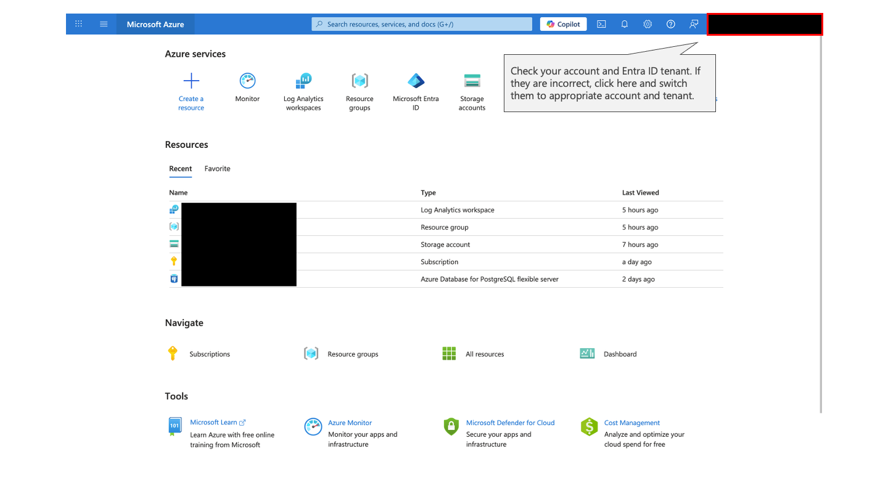
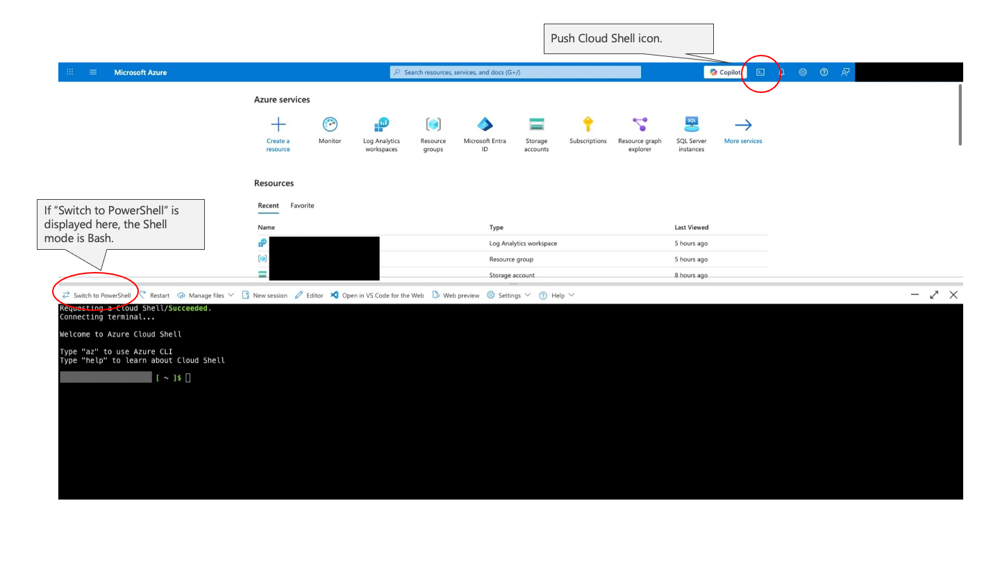
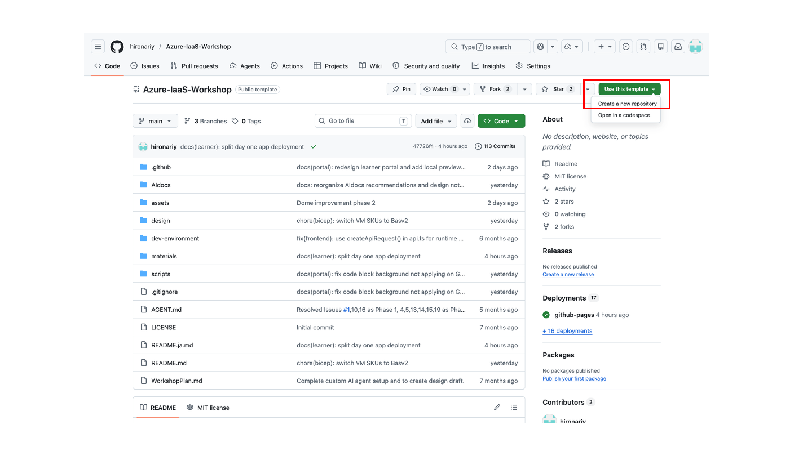
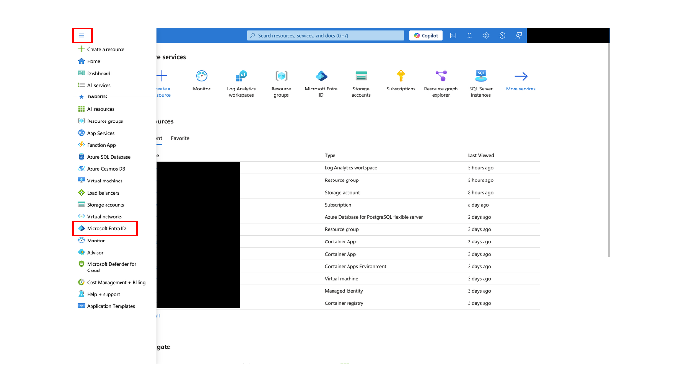
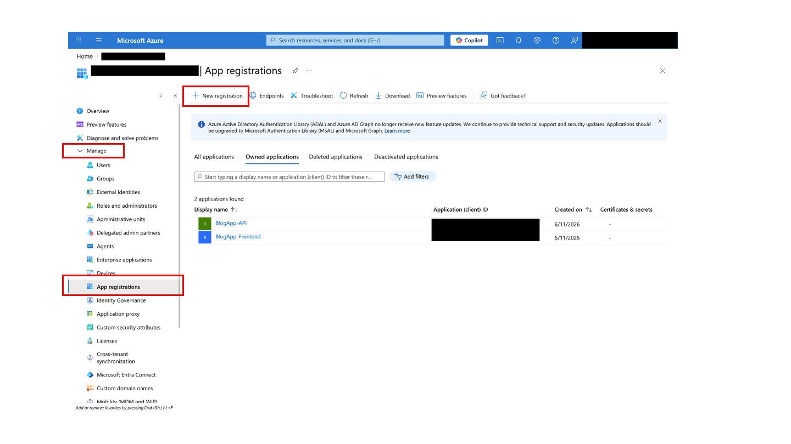
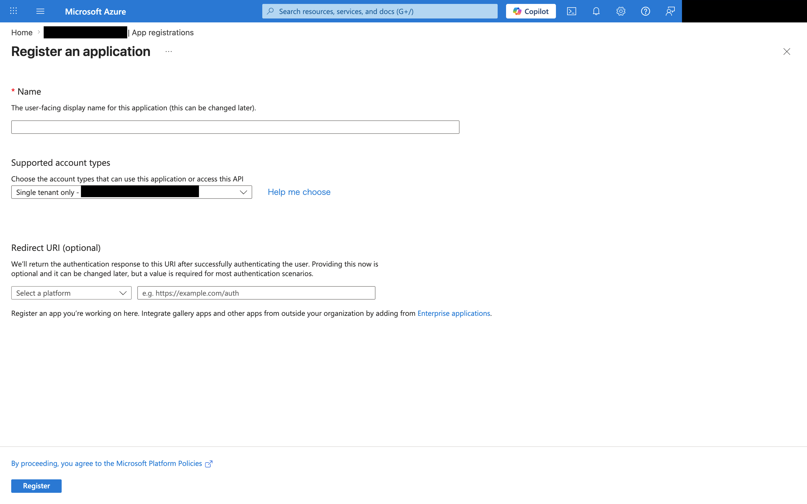
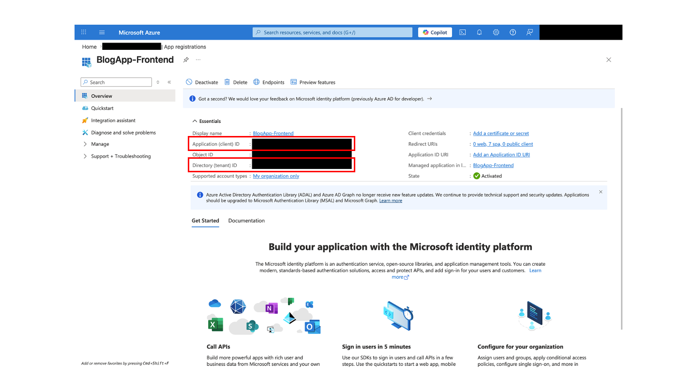
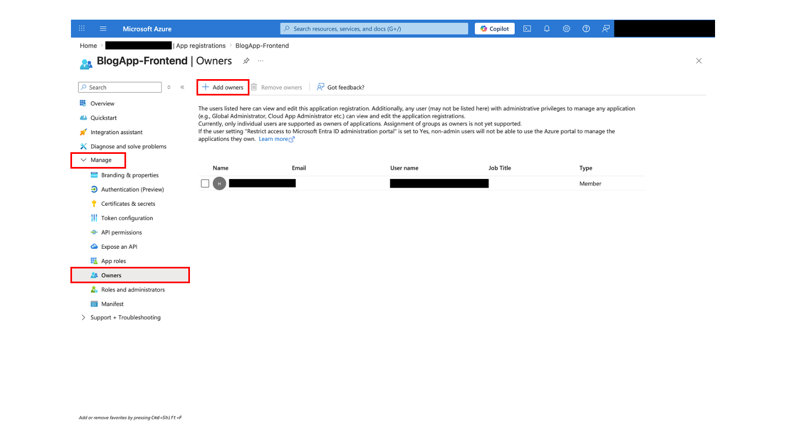
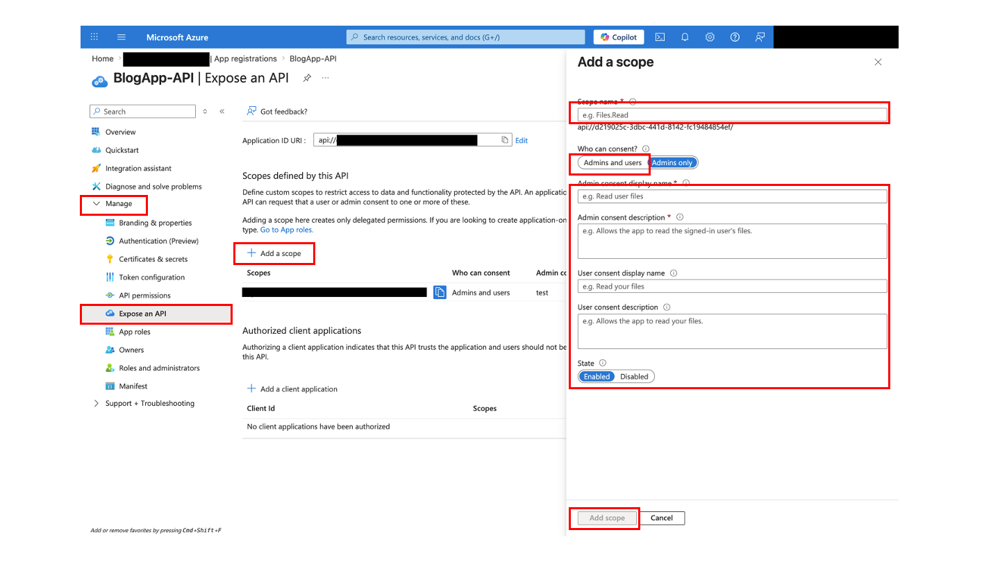
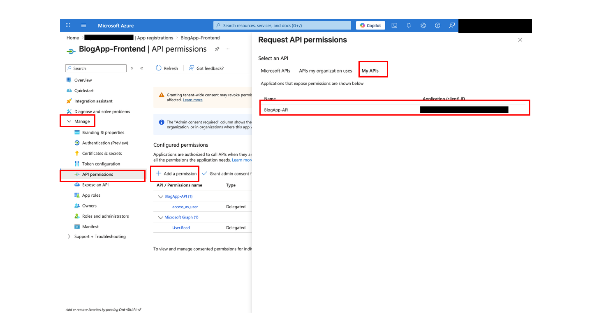

# Day 0: 事前準備

## このページでやること

ワークショップ開始前または冒頭で、Azure Portal、Cloud Shell、Entra ID アプリ登録権限、VM クォータ、GitHub リポジトリ、Admin Object ID の準備を確認します。

| 項目 | 内容 |
|---|---|
| 対象者 | 2 日版ワークショップの受講者 |
| 所要時間 | 30-45 分 |
| 前提 | Azure サブスクリプション、GitHub アカウント、ブラウザ |
| 完了条件 | Day 1 の Cloud Shell デプロイに必要な値と権限が揃っていること |

## ワークショップで構築するアーキテクチャ

Day 1 では、Azure IaaS 上に 3 層構成のブログアプリケーション環境を構築します。インターネットからの HTTPS 通信は Application Gateway で受け、Web tier の NGINX VM、App tier の Express API VM、DB tier の MongoDB レプリカセットへ順に接続します。


*Azure IaaS Workshop で構築する 3 層アーキテクチャ*

各 tier の VM は Availability Zone に分散し、Web tier と App tier の前段には Load Balancer を配置します。管理用の SSH 接続は Azure Bastion 経由で行い、アウトバウンド通信は NAT Gateway、監視データは Azure Monitor / Log Analytics に集約します。Day 0 では、この構成を作るために必要なサブスクリプション、権限、クォータ、アプリ登録情報を準備します。

## 1. Azure Portal にサインインする

1. [Azure Portal](https://portal.azure.com) を開きます。
2. ワークショップで使うアカウントでサインインします。
3. 右上のアカウントとディレクトリが想定どおりか確認します。


*Azure Portalのトップ画面*

**期待結果:** Azure Portal のホームまたはダッシュボードが表示されます。

**チェックポイント:** 複数テナントを持つ場合は、ワークショップで使うテナントへ切り替えてください。

## 2. Cloud Shell を一度起動する

Day 1 で待ち時間を減らすため、事前に Cloud Shell を起動して初回ストレージ作成を完了させます。

1. Azure Portal 上部の Cloud Shell アイコンをクリックします。
2. Bash を選択します。
3. 初回ストレージ作成が表示された場合は、講師の指定に従って作成します。


*Cloud Shell の起動*

**期待結果:** Bash プロンプトが表示されます。

**チェックポイント:** Cloud Shell 起動、リポジトリ clone、SSH 鍵、SSL 証明書作成は Day 1 の Azure リソースデプロイの最初にまとめて行います。ここでは初回起動とストレージ作成だけ完了していれば十分です。

## 3. サブスクリプションとクォータを確認する

Cloud Shell Bash で次を実行します。

```bash
az account show --query "{subscription:name, subscriptionId:id, tenantId:tenantId}" -o table
```

必要に応じてサブスクリプションを切り替えます。

```bash
az account set --subscription "<SUBSCRIPTION_ID_OR_NAME>"
```

このワークショップでは Basv2 シリーズ VM を 6 台使います。

| VM サイズ | 台数 | 各 vCPU | 合計 |
|---|---:|---:|---:|
| Standard_B2als_v2 (Web) | 2 | 2 | 4 |
| Standard_B2als_v2 (App) | 2 | 2 | 4 |
| Standard_B4as_v2 (DB) | 2 | 4 | 8 |
| **合計** | **6** |  | **16 vCPU** |

```bash
az vm list-usage --location japanwest \
  --query "[?contains(name.value, 'standardBASv2Family') || name.value=='cores'].{Name:name.localizedValue, Current:currentValue, Limit:limit}" \
  -o table
```

**期待結果:** Basv2 シリーズまたはリージョン全体で、少なくとも 16 vCPU 分の余裕があることを確認できます。

**チェックポイント:** クォータが不足している場合は、講師に相談してください。リージョン変更やクォータ増加申請が必要になることがあります。

## 4. リソースプロバイダーを確認する

```bash
for provider in Microsoft.Compute Microsoft.Network Microsoft.Storage Microsoft.KeyVault Microsoft.OperationalInsights Microsoft.Insights; do
  az provider show --namespace "$provider" --query "{namespace:namespace,state:registrationState}" -o table
done
```

`NotRegistered` がある場合は、講師の指示に従って登録します。

```bash
az provider register --namespace Microsoft.Compute
```

**期待結果:** 必要なプロバイダーが `Registered` になります。

## 5. GitHub テンプレートリポジトリをコピーする

1. [hironariy/Azure-IaaS-Workshop](https://github.com/hironariy/Azure-IaaS-Workshop) を開きます。
2. **Use this template** > **Create a new repository** を選択します。
3. Owner は自分の GitHub アカウントまたは指定組織を選びます。
4. Repository name は `Azure-IaaS-Workshop` または講師指定の名前にします。
5. Visibility は、組織ポリシーに反しない範囲で Cloud Shell から認証なしで clone できる公開範囲を推奨します。(制限がない限り、Public を推奨)


*GitHub テンプレートリポジトリのコピー*

**期待結果:** 自分用の作業リポジトリが作成されます。

**チェックポイント:** Day 1 ではテンプレート元ではなく、自分のコピーを clone します。

## 6. Entra ID アプリ登録権限を確認する

Microsoft Entra ID でアプリ登録を作成するには、次のいずれかが必要です。

| 権限または設定 | 説明 |
|---|---|
| アプリケーション開発者 | IT 管理者が割り当てるロール |
| クラウドアプリケーション管理者 | IT 管理者が割り当てるロール |
| グローバル管理者 | テナント管理者 |
| ユーザーはアプリケーションを登録できる | テナント設定で許可されている場合 |

確認方法:

1. Azure Portal > Microsoft Entra ID > App registrations を開きます。
2. **New registration** をクリックします。
3. 登録フォームが表示されれば、作成権限があります。

権限がない場合は、講師に相談してください。講師が事前作成した Client ID を配布する場合があります。


*Azure Portal Top から Entra ID への行き方*


*アプリ登録への行き方*


## 7. フロントエンド SPA アプリ登録を作成する

1. Microsoft Entra ID > App registrations > **New registration** を開きます。
2. Name に `BlogApp Frontend <自分またはチーム名>` を入力します。
3. Supported account types は講師指定がなければ **Accounts in this organizational directory only** を選びます。
4. Redirect URI は platform に **Single-page application (SPA)** を選び、`http://localhost:5173` を入力します。
5. Register をクリックします。
6. Overview で **Application (client) ID** と **Directory (tenant) ID** を控えます。
7. 左メニューの **Owners** を開きます。
8. **Add owners** をクリックし、ワークショップでサインインしている自分のアカウントを追加します。
9. Owners の一覧に自分のアカウントが表示されることを確認します。


*アプリ登録最初の画面*


*クライアント ID とテナント ID の確認*


*アプリの所有者の設定*

**期待結果:** フロントエンド用 Client ID を取得でき、Owners に自分のアカウントが表示されます。

**チェックポイント:** Platform は必ず SPA です。Web を選ぶと MSAL.js の認証で `AADSTS9002326` が発生します。アプリ登録を作成しただけでは、環境によって Owners に自分が入らないことがあります。後から自分のアプリ登録を検索・修正しやすくするため、ここで Owners に自分を追加しておきます。

## 8. バックエンド API アプリ登録を作成する

1. App registrations > **New registration** を開きます。
2. Name に `BlogApp API <自分またはチーム名>` を入力します。
3. Redirect URI は空のまま Register します。
4. Overview で **Application (client) ID** を控えます。
5. 左メニューの **Expose an API** を開きます。
6. **Add a scope** をクリックし、Application ID URI は既定値で保存します。
7. Scope name に `access_as_user` を入力します。
8. Who can consent は **Admins and users** を選びます。
9. Admin consent display name と description を入力し、スコープを追加します。
10. 左メニューの **Owners** を開きます。
11. **Add owners** をクリックし、ワークショップでサインインしている自分のアカウントを追加します。
12. Owners の一覧に自分のアカウントが表示されることを確認します。


*バックエンド API アプリ登録での API の公開設定*

**期待結果:** バックエンド API 用 Client ID と `access_as_user` スコープを作成でき、Owners に自分のアカウントが表示されます。

**チェックポイント:** Backend API のアプリ登録も Owners に自分を追加します。所有者が未設定のままだと、後続作業で App registrations の一覧や所有アプリのフィルターから見つけにくくなることがあります。

## 9. フロントエンドに API アクセス許可を追加する

1. フロントエンド SPA のアプリ登録を開きます。
2. **API permissions** > **Add a permission** をクリックします。
3. **APIs my organization uses** または **My APIs** から `BlogApp API <自分またはチーム名>` を選びます。
4. `access_as_user` を選択して追加します。
5. 管理者権限があり講師が指示した場合のみ、admin consent を付与します。


*フロントエンド　アプリ登録での API のアクセス許可*

**期待結果:** フロントエンドアプリにバックエンド API の delegated permission が追加されます。

## 10. Admin Object ID を取得する

Day 1 の Bicep デプロイでは、Key Vault の管理権限を自分の Entra ID ユーザーに付与するために Admin Object ID を使います。これはアプリ登録の Client ID ではなく、ワークショップでサインインしている自分自身の Entra ID object ID です。

Cloud Shell Bash で次を実行します。

```bash
az ad signed-in-user show --query id -o tsv
```

表示された値を **Admin Object ID** として控えます。

必要に応じて、確認しやすい形式で表示します。

```bash
az ad signed-in-user show \
  --query "{displayName:displayName,userPrincipalName:userPrincipalName,objectId:id}" \
  -o table
```

**期待結果:** 自分の Entra ID object ID を取得できます。

**チェックポイント:** `az account show` で表示される Tenant ID と、アプリ登録を作成したテナントが一致していることを確認します。コマンドが権限やテナント設定で失敗する場合は、講師に相談してください。

## 11. Day 1 で使う値を控える

| 値 | 取得場所 | Day 1 のパラメータ |
|---|---|---|
| Tenant ID | 任意のアプリ登録 Overview または `az account show` | `entraTenantId` |
| Backend API Client ID | Backend API アプリ登録 Overview | `entraClientId` |
| Frontend SPA Client ID | Frontend SPA アプリ登録 Overview | `entraFrontendClientId` |
| Admin Object ID | このページの Step 10 | `adminObjectId` |

**チェックポイント:** Client ID と Tenant ID は識別子ですが、公開リポジトリへ作業メモとして雑に push しないでください。パスワードやシークレットは絶対に記録しません。

## 次に進む

[Day 1: Azure リソースデプロイ](day-1-deployment-checklist.ja.md) に進みます。

前のページ: [受講者クイックスタート](learner-quickstart.ja.md)  
迷ったとき: [受講者ポータル](../index.md) / [トラブルシューティングランブック](../operations/troubleshooting-runbook.ja.md)
