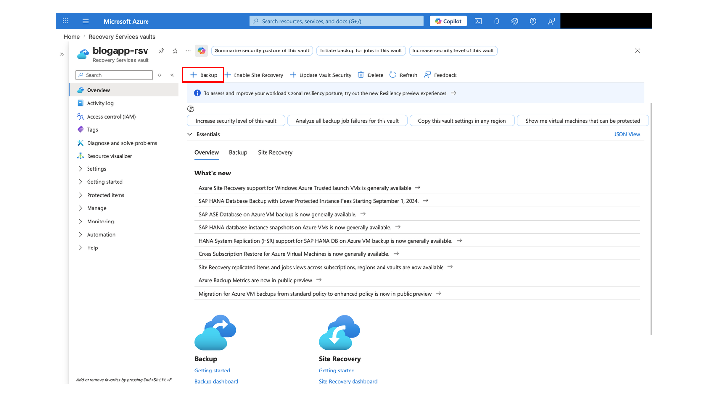
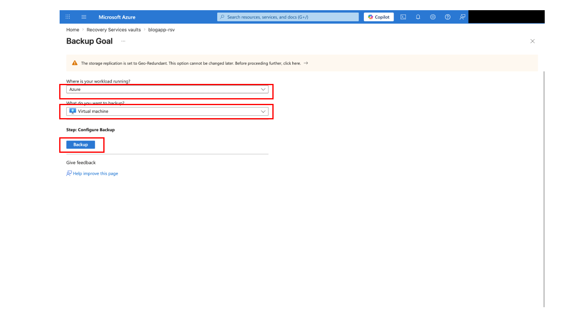
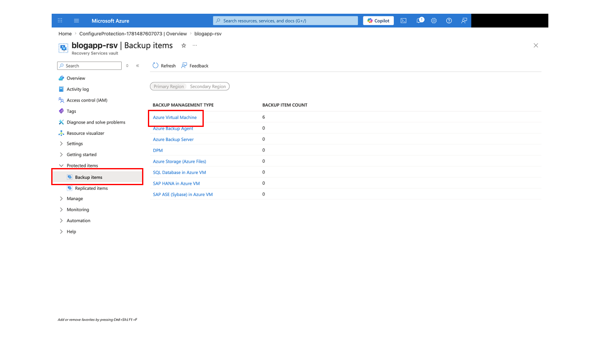
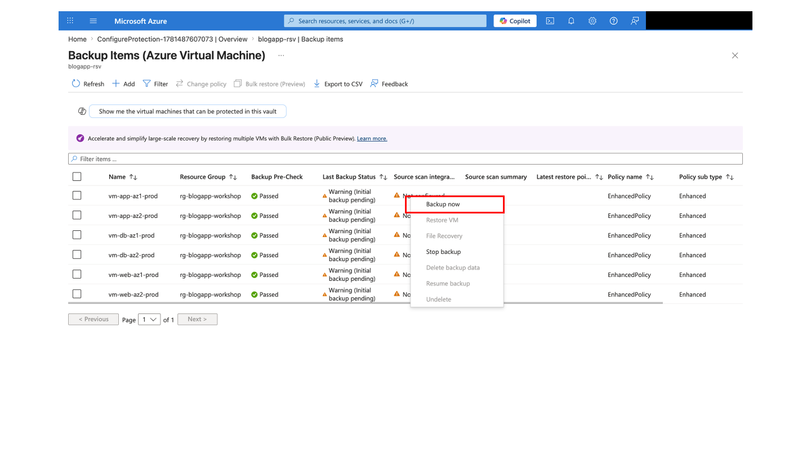
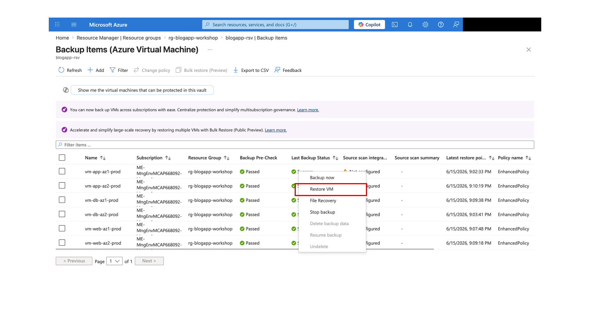
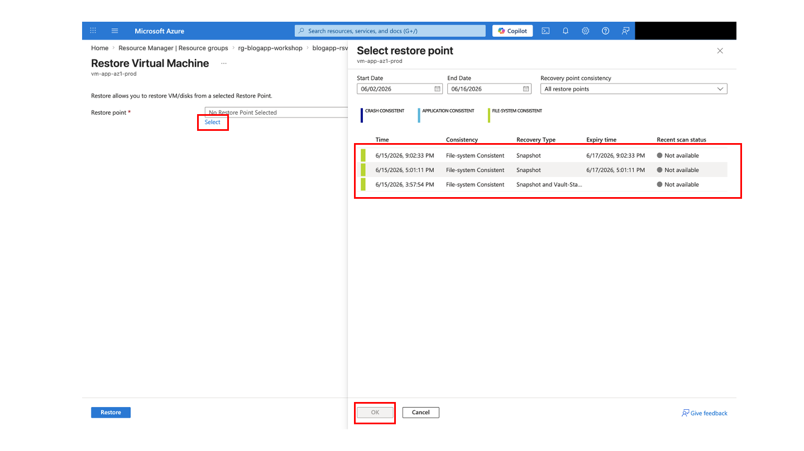

# Day 2: 回復性チェックリスト

## このページでやること

Day 1 で作成した Azure IaaS 環境を使い、Azure Backup、VM 障害時の HA 挙動、Azure Site Recovery (ASR) の考え方と test failover を確認します。Backup / Restore / ASR は Azure Portal 操作を中心に行い、VM の停止・起動や状態確認は Azure Cloud Shell Bash で行います。

| 項目 | 内容 |
|---|---|
| 対象者 | Day 1 のデプロイと基本動作確認を終えた受講者 |
| 所要時間 | 90-150 分 |
| 前提 | Day 1 環境が稼働中、Application Gateway URL でアプリにアクセス可能、Cloud Shell Bash が利用可能 |
| 完了条件 | バックアップ取得、復元ポイント確認、Web/App/DB 障害検証、ASR の replication/test failover の考え方と安全なクリーンアップを説明できること |

## 安全ルール

- 障害検証は必ず講師の合図に合わせて行います。
- 停止した VM は各演習の最後に必ず起動します。
- Backup / Restore / ASR はコストと時間がかかるため、不要な test failover リソースは演習後に削除します。
- DB VM を停止する前に、アプリのテストデータと現在の正常性を確認します。
- ASR の初回レプリケーションは時間がかかる場合があります。ワークショップ時間内に test failover まで進まない場合は、講師デモまたは設計ウォークスルーに切り替えます。

## 0. 作業変数と Day 1 環境を確認する

Cloud Shell Bash で実行します。

```bash
cd ~/Azure-IaaS-Workshop

RESOURCE_GROUP="rg-blogapp-workshop"
FQDN=$(az network public-ip show \
  --resource-group "$RESOURCE_GROUP" \
  --name pip-agw-blogapp-prod \
  --query dnsSettings.fqdn -o tsv)

echo "https://$FQDN"
az vm list --resource-group "$RESOURCE_GROUP" -o table
```

**期待結果:** `vm-web-az1-prod`、`vm-web-az2-prod`、`vm-app-az1-prod`、`vm-app-az2-prod`、`vm-db-az1-prod`、`vm-db-az2-prod`、`vm-db-az3-prod` の 7 台が表示されます。

**チェックポイント:** 複数グループ構成の場合も VM 名は同じで、リソースグループ名だけが異なります。すべてのコマンドで `--resource-group "$RESOURCE_GROUP"` を指定してください。

## 1. テストデータを作成する

1. ブラウザで `https://$FQDN` を開きます。
2. 自己署名証明書の警告を通過します。
3. ログインし、テスト用の投稿を 1 件作成します。
4. 投稿タイトル、作成時刻、投稿者をメモします。

**期待結果:** Backup / Restore や障害検証後に比較できるテスト投稿が存在します。

**チェックポイント:** 個人情報や機密情報を投稿本文に入れないでください。

## 2. Recovery Services vault を作成する

Day 1 の Bicep では Recovery Services vault、Azure Backup、ASR は作成していません。Day 2 では Azure Portal で vault を作成します。

1. Azure Portal で **Recovery Services vaults** (日本語の場合は **リRecovery Services コンテナー**)を検索します。
2. **Create** (日本語の場合は**作成**)をクリックします。
3. Subscription と Resource group は Day 1 と同じものを選びます。
4. Vault name は例として `rsv-blogapp-workshop` のようにします。
5. Region は Day 1 の `LOCATION` と同じリージョンを選びます。
6. Review + create で作成します。

**期待結果:** Recovery Services vault が作成されます。

**チェックポイント:** `materials/bicep` の Storage Account にある `backups` container は、Recovery Services vault とは別物です。Azure VM Backup と ASR は Recovery Services vault で操作します。

## 3. Azure Backup を有効化する

1. 作成した Recovery Services vault を開きます。
2. **Backup** を選択します。
3. Workload location は **Azure**、Workload type は **Virtual machine** を選びます。
4. Backup policy はワークショップ用に短い保持期間のポリシーを作成または選択します。
5. 対象 VM を選択します。時間が限られる場合は、講師が指定する代表 VM だけを対象にします。
6. Enable backup を実行します。


*Recovery Service コンテナー トップ画面*


*Azure Backup 設定画面 1*


*Azure Backup 設定画面 2*

**期待結果:** 対象 VM が backup item として表示されます。

**チェックポイント:** 初回バックアップが完了するまで時間がかかる場合があります。

## 4. オンデマンドバックアップを取得する

1. Recovery Services vault > Backup items を開きます。
2. 対象 VM を選択し、右クリックします。
3. **Backup now** を実行します。
4. Backup jobs で進捗を確認します。


*オンデマンドバックアップ取得 1*


*オンデマンドバックアップ取得 2*

**期待結果:** Backup job が `Completed` になります。

**チェックポイント:** 失敗した場合は、VM が稼働中か、vault と VM が同じサブスクリプション内にあるか、権限が足りているかを確認します。

## 5. 復元ポイントを確認する

1. 対象 backup item を開きます。
2. **Restore VM** または **Restore points** を開きます。
3. 最新の復元ポイントが表示されることを確認します。


*VM リストア 1*



*VM リストア 2*

**期待結果:** 復元ポイントが 1 つ以上表示されます。

**チェックポイント:** 本番相当環境では、復元は既存 VM へ上書きせず、新しい VM または別リソースグループへ復元して検証します。

## 6. Restore 操作を確認する

時間と権限に余裕がある場合のみ、講師の指示に従って Restore VM を実行します。時間が限られる場合は、復元ポイントと復元画面の確認をもって演習完了とします。

**期待結果:** 復元先、ネットワーク、ストレージ、VM 名の指定項目を説明できます。

**チェックポイント:** 復元 VM を作成した場合は、演習後に削除対象としてメモします。

## 7. Web VM 障害を検証する

Web tier は Application Gateway の backend pool に 2 台構成で配置されています。1 台を停止し、サービス継続を確認します。

```bash
az network application-gateway show-backend-health \
  --resource-group "$RESOURCE_GROUP" \
  --name agw-blogapp-prod \
  --query "backendAddressPools[].backendHttpSettingsCollection[].servers[].{address:address,health:health}" \
  -o table

az vm stop --resource-group "$RESOURCE_GROUP" --name vm-web-az1-prod
sleep 90

curl -k "https://$FQDN/"

az network application-gateway show-backend-health \
  --resource-group "$RESOURCE_GROUP" \
  --name agw-blogapp-prod \
  --query "backendAddressPools[].backendHttpSettingsCollection[].servers[].{address:address,health:health}" \
  -o table

az vm start --resource-group "$RESOURCE_GROUP" --name vm-web-az1-prod
```

**期待結果:** 片方の Web VM が停止しても、アプリケーションはもう片方の Web VM 経由で応答します。

**チェックポイント:** `az vm stop` は VM のゲスト OS 停止を模擬します。`az vm deallocate` は割り当て解除まで行うため、演習では講師の指示がない限り使いません。

## 8. App VM 障害を検証する

App tier は内部 Load Balancer の背後に 2 台構成で配置されています。

```bash
az vm stop --resource-group "$RESOURCE_GROUP" --name vm-app-az1-prod
sleep 90

curl -k "https://$FQDN/api/posts"

az vm start --resource-group "$RESOURCE_GROUP" --name vm-app-az1-prod
```

**期待結果:** 片方の App VM が停止しても、API はもう片方の App VM 経由で応答します。

**チェックポイント:** API 応答が不安定な場合は、数分待ってから再試行し、Application Gateway backend health と App VM の起動状態を確認します。

## 9. DB レプリカセットの自動フェイルオーバーを検証する

DB tier は 3 台のデータ保持メンバー（`vm-db-az1` / `az2` / `az3`、Zone 1/2/3、アービターなし）で構成した MongoDB レプリカセットです（Issue #30）。選出と `w=majority` の書き込みには、3 票のうち過半数の **2 票** が必要です。そのため、**どの 1 台が止まっても** 残り 2 台で Primary を自動選出し、書き込みを続けられます。

この演習では、次の 3 つを確認します。

1. Primary の停止（mongod 停止と VM 停止）で自動選出が起きることを確認し、**選出時間** と **アプリの復旧時間** を記録する。
2. Secondary を 1 台ずつ停止しても、読み書きが続くことを確認する。
3. 停止したノードが再参加し、データが一致することを確認する。

> **AWS との比較:** 3 つの AZ にある 3 台の EC2 に MongoDB を自己管理で構成した場合と同じ動きです。Amazon DocumentDB ではレプリカの昇格をサービスが行いますが、ここでは選出の仕組みを自分で観察します。

### 9.1 準備: 状態確認コマンドと API プローブ

Cloud Shell で、DB の状態を表示するコマンドを変数に入れます。停止していない DB VM に対して実行します。MongoDB は認証が有効なため（Issue #36）、最初に管理ユーザー `blogadmin` のパスワード（Day 1 の `<YOUR_MONGODB_ADMIN_PASSWORD>`）を入力します。入力は画面に表示されず、この Cloud Shell セッションの変数にだけ保持されます。9.5 でも同じ変数を使います。

```bash
read -rsp 'MongoDB admin password: ' MONGO_ADMIN_PASSWORD; echo
MONGO_AUTH="-u blogadmin -p '$MONGO_ADMIN_PASSWORD' --authenticationDatabase admin"
RS_STATUS='mongosh '"$MONGO_AUTH"' --quiet --eval "rs.status().members.forEach(m => print(m.name, m.stateStr, \"health=\" + m.health, m.electionDate ? \"elected=\" + m.electionDate.toISOString() : \"\"))"'
db_status() {
  az vm run-command invoke -g "$RESOURCE_GROUP" -n "$1" \
    --command-id RunShellScript --scripts "$RS_STATUS" \
    --query "value[0].message" -o tsv
}
db_status vm-db-az2-prod
```

**期待結果:** `10.0.3.4:27017 PRIMARY` が 1 行、`SECONDARY` が 2 行（`10.0.3.5`、`10.0.3.6`）表示されます。

API を 2 秒ごとに呼び出し、結果をファイルに記録するプローブをバックグラウンドで開始します（約 15 分で自動停止します）。

```bash
( for i in $(seq 1 450); do
    echo "$(date -u +%H:%M:%S) $(curl -k -s -o /dev/null -w '%{http_code}' --max-time 8 "https://$FQDN/api/posts")"
    sleep 2
  done ) > ~/db-failover-probe.log 2>&1 &
PROBE_PID=$!
```

### 9.2 Primary の mongod を停止する

```bash
date -u +%H:%M:%S    # 停止開始時刻 (T0) としてメモ
az vm run-command invoke -g "$RESOURCE_GROUP" -n vm-db-az1-prod \
  --command-id RunShellScript --scripts "sudo systemctl stop mongod"
db_status vm-db-az2-prod
```

**期待結果:** `10.0.3.5` または `10.0.3.6` が `PRIMARY` になり、`elected=` に選出時刻が表示されます。`10.0.3.4` は `(not reachable/healthy)` です。

ブラウザで投稿を 1 件作成し、既存の投稿を 1 件編集します。どちらも成功します（アプリの再起動も、レプリカセットの手動再構成も不要です）。

```bash
grep -v ' 200$' ~/db-failover-probe.log | tail -20   # 失敗した時刻の範囲
```

記録します。

- **選出時間** = `elected=` の時刻 − T0（目安: 約 10-15 秒。既定の `electionTimeoutMillis` は 10 秒）
- **アプリ復旧時間** = プローブで 200 以外が最後に出た時刻の次の `200` − T0（目安: 選出時間 + 数秒）

mongod を起動して戻します。

```bash
az vm run-command invoke -g "$RESOURCE_GROUP" -n vm-db-az1-prod \
  --command-id RunShellScript --scripts "sudo systemctl start mongod"
sleep 30
db_status vm-db-az2-prod
```

**期待結果:** `10.0.3.4` が `SECONDARY` として再参加し、oplog で追いつきます。追いついた後、priority 2 の `10.0.3.4` は **短い 2 回目の選出（priority takeover）** で `PRIMARY` に戻ります。このときもアプリは数秒以内に復旧します。

### 9.3 Primary の VM を停止する

ホスト全体の障害を模擬します。

```bash
date -u +%H:%M:%S    # T0
az vm stop --resource-group "$RESOURCE_GROUP" --name vm-db-az1-prod
db_status vm-db-az2-prod
```

**期待結果:** 9.2 と同様に、残り 2 台の一方が `PRIMARY` になります。ブラウザで投稿の作成と編集が成功します。選出時間とアプリ復旧時間を 9.2 と同じ方法で記録します（`az vm stop` はゲスト OS の停止を待つため、T0 は「コマンド開始」ではなく、プローブで最初に失敗した時刻を目安にしても構いません）。

```bash
az vm start --resource-group "$RESOURCE_GROUP" --name vm-db-az1-prod
sleep 60
db_status vm-db-az2-prod
```

### 9.4 Secondary を 1 台ずつ停止する

```bash
az vm stop --resource-group "$RESOURCE_GROUP" --name vm-db-az2-prod
db_status vm-db-az1-prod
# ブラウザで投稿を作成・編集する
az vm start --resource-group "$RESOURCE_GROUP" --name vm-db-az2-prod
sleep 60
db_status vm-db-az1-prod

az vm stop --resource-group "$RESOURCE_GROUP" --name vm-db-az3-prod
db_status vm-db-az1-prod
# ブラウザで投稿を作成・編集する
az vm start --resource-group "$RESOURCE_GROUP" --name vm-db-az3-prod
sleep 60
db_status vm-db-az1-prod
```

**期待結果:** Secondary を停止しても選出は起きず、Primary は `10.0.3.4` のままです。投稿の作成と編集は成功します（Primary + 残りの Secondary = 2 票で過半数）。起動後、停止したノードは `SECONDARY`（`health=1`）に戻ります。

### 9.5 再参加したノードのデータ一致を確認する

```bash
COUNT='mongosh '"$MONGO_AUTH"' --quiet --eval "db.getMongo().setReadPref(\"secondaryPreferred\"); print(db.getSiblingDB(\"blogapp\").posts.countDocuments())"'
for vm in vm-db-az1-prod vm-db-az2-prod vm-db-az3-prod; do
  echo "$vm: $(az vm run-command invoke -g "$RESOURCE_GROUP" -n $vm --command-id RunShellScript --scripts "$COUNT" --query "value[0].message" -o tsv | grep -E '^[0-9]+$')"
done
kill "$PROBE_PID" 2>/dev/null
```

**期待結果:** 3 台とも同じ件数です（演習中に作成した投稿を含みます）。

### 9.6 2 台を同時に失うと過半数を失う（説明のみ）

> **重要:** 3 台のうち **2 台** が停止すると、残り 1 台は 3 票中 1 票しか持たないため、**Primary を選出できません**。残ったノードは `SECONDARY` のままとなり、API の書き込みも（読み取り設定によっては読み取りも）失敗します。これは、過半数を持たない側が書き込みを受け付けて後でロールバックされる事態（スプリットブレイン）を防ぐための、MongoDB の正しい動作です。2 台目が戻れば自動で回復します。`rs.reconfig({force: true})` は通常運用では使いません（DR の最終手段です。[災害復旧ガイド](../operations/disaster-recovery-guide.ja.md) を参照）。この状態は講師デモでのみ確認し、受講者環境では 2 台を同時に停止しないでください。

**なぜアービターを使わないのか:** Primary + Secondary + アービター（PSA）でも票数は 3 です。しかし、データ保持ノードが 1 台止まると、データを持つのは 1 台だけになります。`w=majority` の書き込みには、データを持つメンバー 2 台の確認が必要なため、書き込みが止まります。3 台ともデータを持つ構成（PSS）なら、1 台の障害で選出も書き込みも止まりません。

| 演習 | T0 | 新 Primary | 選出時刻 | 選出時間 | アプリ復旧時間 |
|---|---|---|---|---|---|
| 9.2 mongod 停止 |  |  |  |  |  |
| 9.3 VM 停止 |  |  |  |  |  |

**チェックポイント:** 演習後は 3 台の DB VM がすべて running で、`db_status` に `PRIMARY` 1 台と `SECONDARY` 2 台が表示されることを確認してください。

## 10. VM がすべて running に戻ったことを確認する

```bash
az vm list \
  --resource-group "$RESOURCE_GROUP" \
  --show-details \
  --query "[].{name:name,powerState:powerState}" \
  -o table
```

**期待結果:** 7 台すべてが `VM running` です。

**チェックポイント:** 停止した VM がある場合は、次のコマンドで起動します。

```bash
az vm start --resource-group "$RESOURCE_GROUP" --name <VM_NAME>
```

## 11. ASR レプリケーションを有効化する

ASR は時間がかかるため、講師デモまたは代表 VM での演習にする場合があります。

1. Recovery Services vault を開きます。
2. **Site Recovery** を開きます。
3. **Enable replication** を選択します。
4. Source は Day 1 のリソースグループとリージョンを選びます。
5. Target region は講師指定のリージョンを選びます。
6. ターゲット VNet / subnet のマッピングを確認します。
7. 代表 VM または講師指定の VM を選択します。
8. Enable replication を実行します。

**期待結果:** Replicated item が作成され、initial replication が開始または完了します。

**チェックポイント:** 初回レプリケーションが完了しない場合、test failover は講師デモまたは設計ウォークスルーに切り替えます。

## 12. Test failover を確認する

Test failover は本番側に影響しない分離ネットワークで行います。

1. Replicated item または Recovery Plan を開きます。
2. **Test failover** を選択します。
3. 復旧ポイントとテスト用 VNet を選択します。
4. Test failover を開始します。
5. 起動したテスト VM とネットワークを確認します。
6. 検証後、**Cleanup test failover** を実行します。

**期待結果:** Test failover の流れと、本番影響を避けるための分離ネットワークの意味を説明できます。

**チェックポイント:** Cleanup test failover を実行しないと、不要なテストリソースが残り課金や混乱の原因になります。

## Day 2 完了条件

- Recovery Services vault を作成できた。
- 対象 VM の Backup を有効化し、復元ポイントを確認できた。
- Web VM 停止時の HA 挙動を確認し、VM を起動状態へ戻した。
- App VM 停止時の HA 挙動を確認し、VM を起動状態へ戻した。
- DB の Primary 停止で自動選出が起きることを確認し、選出時間とアプリ復旧時間を記録した。
- Secondary を 1 台ずつ停止しても読み書きが続き、再参加後にデータが一致することを確認した。
- 2 台を同時に失うと過半数を失い、書き込みができなくなる理由を説明できた。
- ASR の replication health と test failover の考え方を説明できた。
- Test failover を実施した場合は、cleanup が完了している。
- 7 台の VM がすべて `VM running` である。

## 迷ったとき

- 症状別の確認は [トラブルシューティングランブック](../operations/troubleshooting-runbook.ja.md) を参照します。
- コマンドとリソース名は [クイックリファレンス](../reference/quick-reference-card.ja.md) を参照します。
- BCDR の背景説明は [災害復旧ガイド](../operations/disaster-recovery-guide.ja.md) を参照します。

前のページ: [監視ガイド](../operations/monitoring-guide.ja.md)
戻る: [受講者ポータル](../index.md)
