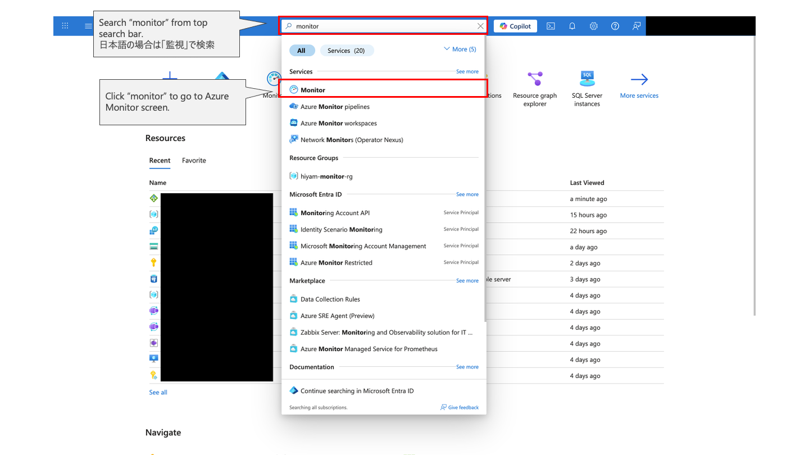
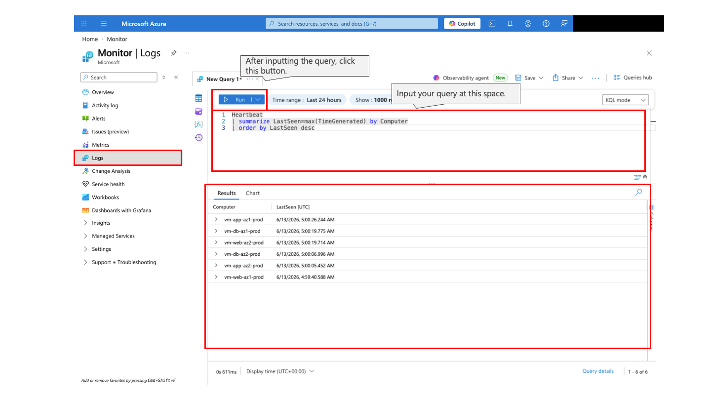
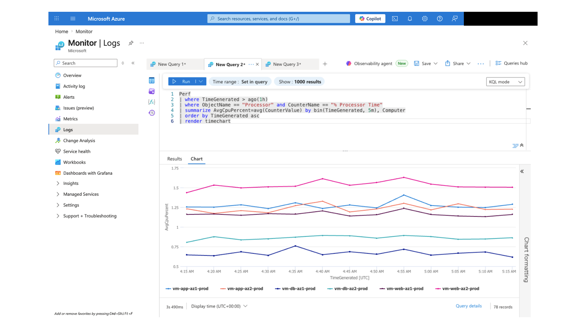

# 監視ガイド（Azure Monitor + Log Analytics）

## このページでやること

Day 1 でデプロイした Azure IaaS 環境を、Azure Monitor と Log Analytics で確認します。Application Gateway から Web、App、DB の順に外側から内側へ追い、正常性、遅延、エラーの見方を学びます。

| 項目 | 内容 |
|---|---|
| 対象者 | Day 1 のデプロイ後に監視確認を行う受講者 |
| 所要時間 | 30-45 分 |
| 前提 | Day 1 の Azure リソースデプロイ、アプリデプロイ、DCR 構成が完了していること |
| 完了条件 | Application Gateway backend health、VM Heartbeat、基本 KQL クエリを確認できること |

## 1. 監視の全体像

| 観点 | Azure で見る場所 | AWS との類比 |
|---|---|---|
| メトリック | Azure Monitor Metrics | CloudWatch Metrics |
| ログ集約 | Log Analytics workspace | CloudWatch Logs + Logs Insights |
| 制御プレーン操作 | Activity log | CloudTrail に近い操作履歴 |
| VM ゲスト情報 | Azure Monitor Agent + DCR | CloudWatch Agent |
| 入口の正常性 | Application Gateway backend health | ALB target health |

Day 1 の Bicep は Log Analytics workspace と VM 拡張を作成します。Data Collection Rule (DCR) は、Log Analytics table の初期化を待つ必要があるため、`scripts/configure-dcr.sh` で後から作成します。

## 2. 入口から正常性を確認する

まず Application Gateway の backend health を確認します。

```bash
RESOURCE_GROUP="rg-blogapp-workshop"

az network application-gateway show-backend-health \
  --resource-group "$RESOURCE_GROUP" \
  --name agw-blogapp-prod \
  --query "backendAddressPools[].backendHttpSettingsCollection[].servers[].{address:address,health:health}" \
  -o table
```

**期待結果:** Web tier backend が Healthy と表示されます。

**チェックポイント:** Unhealthy がある場合は、[トラブルシューティングランブック](troubleshooting-runbook.ja.md) を参照します。

## 3. VM の Heartbeat を確認する

Azure Portal で Log Analytics workspace を開き、Logs で次を実行します。


Azure Portal Top画面から Azure Monitor の画面への行き方

```kusto
Heartbeat
| summarize LastSeen=max(TimeGenerated) by Computer
| order by LastSeen desc
```


Heartbeat に対するクエリの実行

**期待結果:** Web / App / DB VM の `Computer` と `LastSeen` が表示されます。

**チェックポイント:** DCR 作成直後はデータが出るまで数分かかることがあります。

## 4. CPU とメモリの傾向を確認する

```kusto
Perf
| where TimeGenerated > ago(1h)
| where ObjectName == "Processor" and CounterName == "% Processor Time"
| summarize AvgCpuPercent=avg(CounterValue) by bin(TimeGenerated, 5m), Computer
| order by TimeGenerated asc
| render timechart
```

```kusto
Perf
| where TimeGenerated > ago(1h)
| where ObjectName == "Memory" and CounterName == "% Used Memory"
| summarize AvgMemoryUsedPercent=avg(CounterValue) by bin(TimeGenerated, 5m), Computer
| order by TimeGenerated asc
| render timechart
```



**期待結果:** CPU とメモリ使用率が、それぞれ VM ごとの折れ線グラフとして表示されます。

**チェックポイント:** テーブルや counter 名は DCR 設定に依存します。結果がない場合は `Perf | take 20` で実データを確認してください。グラフが表示されない場合は、Logs の表示モードで **Chart** が選ばれているかも確認します。

## 5. Syslog のエラーを確認する

```kusto
Syslog
| where SeverityLevel in ("err", "crit", "alert", "emerg")
| project TimeGenerated, Computer, Facility, SeverityLevel, SyslogMessage
| order by TimeGenerated desc
| take 50
```

**期待結果:** OS やサービスのエラー傾向を確認できます。

**チェックポイント:** 何も出ないこと自体は正常な場合があります。障害演習後に再度確認すると、停止や再起動に関するログが見えることがあります。

## 6. Application Gateway ログを確認する

診断設定で Application Gateway のログを Log Analytics に送っている場合、次のように探索できます。

```kusto
search "ApplicationGateway"
| order by TimeGenerated desc
| take 50
```

HTTP 5xx の傾向を探す場合:

```kusto
search " 500 " or " 502 " or " 503 "
| order by TimeGenerated desc
| take 100
```

**期待結果:** Application Gateway 関連ログが入っていれば、アクセスやエラーの傾向を確認できます。

**チェックポイント:** ログカテゴリやテーブル名は診断設定により異なるため、最初は `search * | take 50` で入っているデータを把握します。

## 7. Day 2 の障害検証で見るポイント

| 演習 | 監視で見るもの | 期待する観測 |
|---|---|---|
| Web VM 停止 | Application Gateway backend health | 片方の backend が Unhealthy、アプリは継続 |
| App VM 停止 | API 疎通、VM Heartbeat | API が継続または短時間で復旧 |
| DB VM 停止 | API 疎通、Syslog、VM 状態 | 一時的な失敗の有無と復旧後の安定 |
| ASR test failover | Recovery Services vault job | Test failover job と cleanup 状態 |

## 8. よくあるつまずき

| 症状 | 確認すること | 対処 |
|---|---|---|
| Heartbeat が出ない | DCR が作成・関連付け済みか | `./scripts/configure-dcr.sh "$RESOURCE_GROUP"` を確認 |
| Perf が出ない | Table 初期化と DCR counter | 数分待つ、`Perf | take 20` を実行 |
| App Gateway ログがない | Diagnostic settings | Application Gateway から Log Analytics への送信を有効化 |
| VM 停止後に戻らない | VM power state | `az vm start` で起動 |

## 完了条件

- Application Gateway backend health を確認できた。
- Log Analytics で Heartbeat を確認できた。
- Perf または Syslog の基本クエリを実行できた。
- Day 2 の障害検証で、どのメトリックやログを見るべきか説明できる。

## 次に進む

Day 2 の演習は [Day 2: 回復性チェックリスト](../learner/day-2-resiliency-checklist.ja.md) に進みます。

前のページ: [Day 1: アプリデプロイ](../learner/day-1-app-deployment.ja.md)
迷ったとき: [トラブルシューティングランブック](troubleshooting-runbook.ja.md) / [クイックリファレンス](../reference/quick-reference-card.ja.md)
戻る: [受講者ポータル](../index.md)
